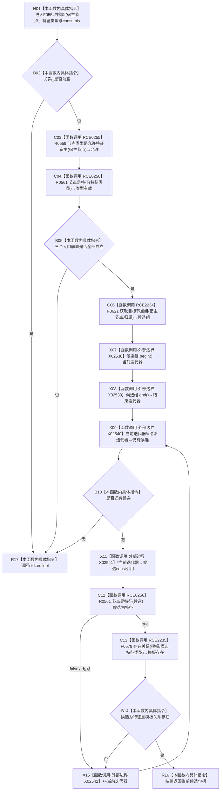

# CF-L5-0219 特征服务读取宿主特征槽位现状流程图

图类型：现状流程图
代码版本：`14d539ed7ad8af87f35fb0752eed420bbe443316`
源码 blob：`4c7bcd451f2e46e85d707a40c371dcbeaa2c1169`
覆盖文件：`海中鱼巣/领域/特征服务.h:262-273`
唯一根函数：F0554
完整签名：`std::optional<海中鱼巣::节点句柄> 海中鱼巣::特征服务::读取宿主特征槽位(海中鱼巣::节点句柄 宿主节点, 海中鱼巣::节点句柄 特征类型) const`
参数：`宿主节点`、`特征类型` 按值传入；隐式 const `this` 为非拥有借用
返回结果：前置成立且归属候选中首个同时为特征节点并存在模板关系的候选句柄；否则返回 `std::nullopt`
已登记调用方：R0249 经 RCE0845、F0265 经 RCE0096、F0551 经 E1251、R0579 经 RCE1597
直接项目函数：RCE0255→R0559；RCE0256→R0561（第 263、268 行）；RCE2234→F0621；RCE2235→F0579
外部边界：X02538 `begin`、X02539 `end`、X02540 迭代器 `operator!=`、X02541 迭代器 `operator*`、X02542 迭代器 `operator++`
未解析项目调用：0
调用图：`流程图/主程序可达调用关系/01_main可达项目调用边表.md`
逐行映射表：`流程图/代码流程图/L5/CF-L5-0219_特征服务读取宿主特征槽位_逐行代码映射表.md`
偏差清单：无；本文只冻结当前代码事实
依据提交 / 结构化消息：当前提交、F0554、RCE0096、E1251、RCE0845、RCE1597、RCE0255—RCE0256、RCE2234—RCE2235、X02538—X02542 与源码 262—273 行交叉复核
结构读取与写入：只读节点类型与关系；不写特征、关系或索引
逻辑内返回：仓库指针为空、宿主类型不允许、目标不是特征或无匹配候选时返回空 optional
内部错误：本函数无写后异常分支
生命周期与资源释放：候选组和循环引用均为局部；返回句柄按值
异常：未捕获；被调读取异常沿调用栈传播
并发 / 幂等：只读；候选组与后续存在关系判断不构成显式事务快照
验证输出：262—273 行完整映射；4 条项目入边、4 条项目出边、5 个外部边界、0 个未解析调用
不得作为施工许可：是
不得宣称：返回槽位证明当前值唯一、特征值存在或业务状态完整

## 流程图

## 节点合同

| 节点 | 类型 | 输入绑定 | 输出绑定 | 事实读写 | 后继 |
| --- | --- | --- | --- | --- | --- |
| N01 / B02 | 本函数内具体指令 | 两个句柄、const `this`、`关系_` | 入口状态 | 只读指针 | null→R17；非 null→C03 |
| C03 / C04 / B05 | 函数调用 / 本函数内具体指令 | 宿主节点、特征类型 | 前置 bool | 只读节点类型 | false→R17；true→C06 |
| C06 | 函数调用 | 宿主节点、归属 | 候选组 | 只读关系 | X07 |
| X07—X11 / B10 | 函数调用 / 本函数内具体指令 | 候选组与迭代器 | 当前候选或结束 | 无持久写入 | 候选→C12；结束→R17 |
| C12 / C13 / B14 | 函数调用 / 本函数内具体指令 | 候选、特征类型 | 匹配 bool | 只读节点与模板关系 | false→X15；true→R16 |
| X15 | 函数调用 | 当前迭代器 | 下一迭代位置 | 无 | X09 |
| R16 / R17 | 本函数内具体指令 | 候选或无匹配 | optional 句柄 | 无 | 结束 |

## 当前边界

- 第 266 行精确绑定 F0621 的两参数无令牌重载，不绑定三参数顺序号重载 F0620 或带令牌 R0077。
- 第 268 行精确绑定 F0579 的三参数无令牌重载，不绑定带令牌 R0081。
- 第 267 行范围 `for` 的五个编译器展开标准库调用分别登记为 X02538—X02542。
- 循环按候选组原顺序返回首个匹配项；本函数不检查多个匹配是否构成歧义。
