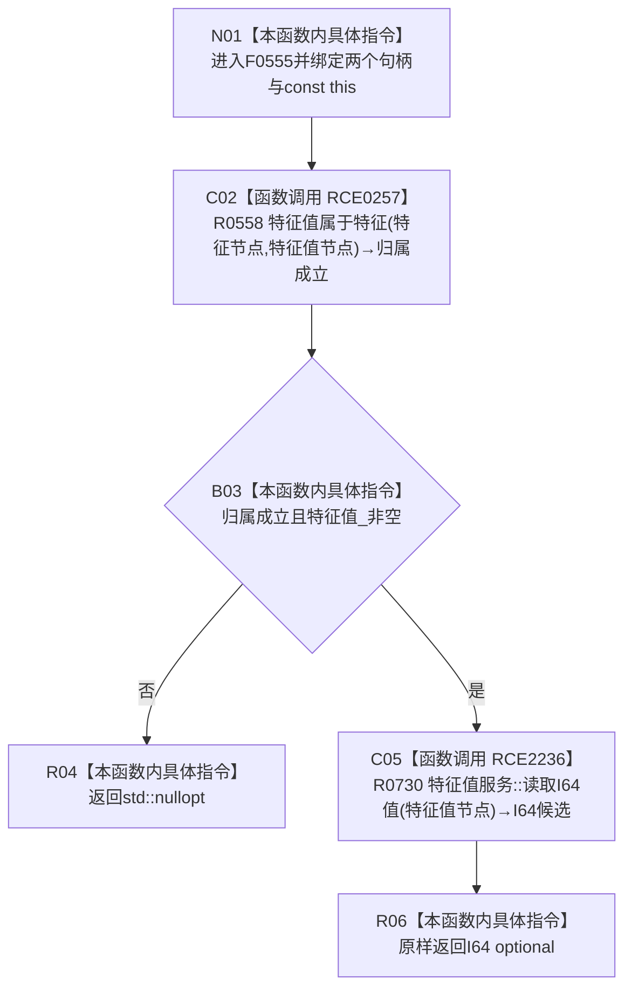

# CF-L5-0220 特征服务读取 I64 特征值现状流程图

图类型：现状流程图
代码版本：`14d539ed7ad8af87f35fb0752eed420bbe443316`
源码 blob：`4c7bcd451f2e46e85d707a40c371dcbeaa2c1169`
覆盖文件：`海中鱼巣/领域/特征服务.h:363-368`
唯一根函数：F0555
完整签名：`std::optional<std::int64_t> 海中鱼巣::特征服务::读取I64特征值(海中鱼巣::节点句柄 特征节点, 海中鱼巣::节点句柄 特征值节点) const`
参数：`特征节点`、`特征值节点` 按值传入；隐式 const `this` 为非拥有借用
返回结果：归属成立且 `特征值_` 非空时原样返回特征值服务的 I64 optional；否则返回 `std::nullopt`
已登记调用方：R0249 经 RCE0846、F0265 经 RCE0097、F0551 经 E1253、R0579 经 RCE1598
直接项目函数：RCE0257→R0558；RCE2236→R0730
外部边界：无
未解析项目调用：0
调用图：`流程图/主程序可达调用关系/01_main可达项目调用边表.md`
逐行映射表：`流程图/代码流程图/L5/CF-L5-0220_特征服务读取I64特征值_逐行代码映射表.md`
偏差清单：无；本文只冻结当前代码事实
依据提交 / 结构化消息：当前提交、F0555、RCE0097、E1253、RCE0846、RCE1598、RCE0257、RCE2236、R0730 与源码 363—368 行交叉复核
结构读取与写入：只读特征值归属与 I64 材料；不写特征、特征值或关系
逻辑内返回：归属不成立、服务指针为空或被调读取为空时返回空 optional
内部错误：本函数无写后异常分支
生命周期与资源释放：句柄按值；服务对象只借用；optional 按值返回
异常：未捕获；被调函数异常沿调用栈传播
并发 / 幂等：只读；归属检查与值读取不构成显式事务快照
验证输出：363—368 行完整映射；4 条项目入边、2 个直接项目被调目标、0 个外部边界、0 个未解析调用
不得作为施工许可：是
不得宣称：返回 I64 值证明该值是当前槽位唯一值、状态事实或业务结论

## 流程图

## 节点合同

| 节点 | 类型 | 输入绑定 | 输出绑定 | 事实读写 | 后继 |
| --- | --- | --- | --- | --- | --- |
| N01 | 本函数内具体指令 | 两个句柄、const `this` | 进入读取 | 无 | C02 |
| C02 / B03 | 函数调用 / 本函数内具体指令 | 两个句柄、`特征值_` | 前置 bool | 只读归属与指针 | false→R04；true→C05 |
| C05 | 函数调用 | `特征值_`、特征值节点 | optional I64 | 只读特征值材料 | R06 |
| R04 / R06 | 本函数内具体指令 | 空或被调 optional | optional I64 返回值 | 无 | 结束 |

## 当前边界

- RCE0257 精确绑定 F0555 内部的无令牌 `特征值属于特征(特征节点,特征值节点)`。
- 第 367 行静态接收者是 `特征值服务*`，精确绑定 R0730，不绑定 `主信息仓库::读取I64值` 的任一重载。
- 本函数只验证“特征值属于特征”，不验证该特征值是实例槽位的唯一当前值。
