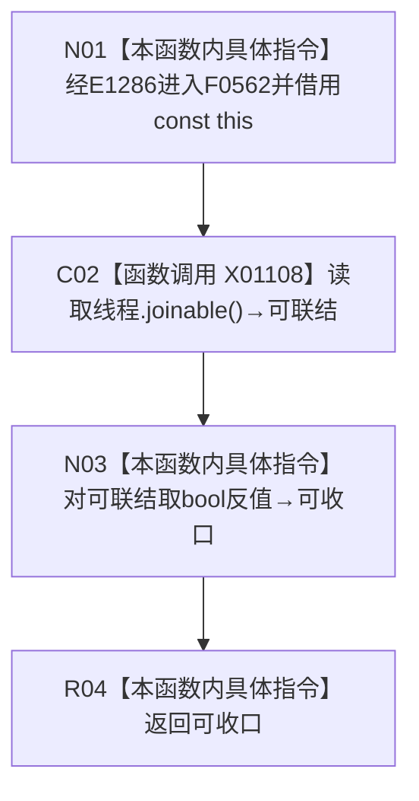

# CF-L5-0221 自我线程线程可收口现状流程图

图类型：现状流程图
代码版本：`14d539ed7ad8af87f35fb0752eed420bbe443316`
源码 blob：`33a355deebc02a2d9eb370a5003312415125210c`
覆盖文件：`海中鱼巣/线程/自我线程.ixx:146-148`
唯一根函数：F0562
完整签名：`bool 海中鱼巣::自我线程::线程可收口() const`
参数：无显式参数；隐式 const `this` 为调用期间有效的非拥有借用
返回结果：对 X01108 的 `std::thread::joinable()` 结果取 bool 反值；线程不可 join 时返回 true，否则返回 false
已登记调用方：F0267 经 E1286 调用
直接项目函数：无
外部边界：X01108→`std::thread::joinable() const noexcept`
未解析项目调用：0
调用图：`流程图/主程序可达调用关系/01_main可达项目调用边表.md`
逐行映射表：`流程图/代码流程图/L5/CF-L5-0221_自我线程线程可收口_逐行代码映射表.md`
偏差清单：无；本文只冻结当前代码事实
依据提交 / 结构化消息：当前提交、F0562、E1286、X01108 与源码 146—148 行交叉复核
结构读取与写入：只读 `线程` 的 joinable 状态；不修改线程、节点或其它机器结构
逻辑内返回：两个 bool 结果均为本函数正常返回
内部错误：本函数没有内部错误分支
生命周期与资源释放：只借用 const `this`；不 join、不 detach、不转移线程所有权
异常：X01108 为 noexcept；本函数未增加异常
并发 / 幂等：重复读取不写结构；结果取决于读取时刻的 `线程` 状态，不构成同步快照
验证输出：146—148 行完整映射；1 条项目入边、0 个项目出边、1 个外部边界、0 个未解析调用
不得作为施工许可：是
不得宣称：返回 true 证明线程已经执行完成、已 join、生命周期验收或自我循环已经完成

## 流程图

## 节点合同

| 节点 | 类型 | 输入绑定 | 输出绑定 | 事实读写 | 后继 |
| --- | --- | --- | --- | --- | --- |
| N01 | 本函数内具体指令 | E1286 的隐式 const `this` | 进入状态读取 | 无 | C02 |
| C02 | 函数调用 | 成员 `线程` | X01108 的 joinable bool | 只读线程库状态 | N03 |
| N03 | 本函数内具体指令 | joinable bool | 取反后的可收口 bool | 无 | R04 |
| R04 | 本函数内具体指令 | 可收口 bool | 返回调用方 | 无 | 结束 |

## 当前边界

- X01108 只覆盖 `std::thread::joinable()` 调用；一元 `!` 是 F0562 内的具体指令，不并入外部边界。
- “可收口”在当前实现中仅等于 `!线程.joinable()`；本函数不执行 join 或 detach，也不读取线程任务完成事实。
