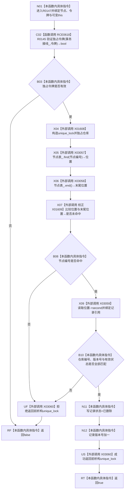

# CF-L5-0222 节点仓库删除节点带令牌重载现状流程图

图类型：现状流程图
代码版本：`010784a906e8283644a63a742151f6457a847c38`
源码事实提交：`3920a74638264f9f539d50f32f3c9fe5fb1982ab`
源码 blob：`f38b979a3f7cefd182a50e0b687c5a6fffebc91c`
覆盖文件：`海中鱼巣/核心/节点仓库.cpp:350-360`
唯一根函数：R0147
完整签名：`bool 海中鱼巣::节点仓库::删除节点(海中鱼巣::节点句柄 节点, const 海中鱼巣::结构事务令牌& 令牌)`
参数：`节点` 按值传入；`令牌` 为 const 非拥有借用；隐式 `this` 为可变节点仓库借用
返回结果：独占令牌、节点编号、仓库编号、版本和有效状态全部匹配时标记删除、推进版本并返回 true，否则返回 false
已登记调用方：F0261/F0523/R0224/R0244/R0245/R0574，经 RCE0074/RCE0252/RCE0782/RCE0829/RCE0833/RCE1590
直接项目函数：RCE0618→R0145；RCE0617 已删除，不存在 R0147→R0143 调用
外部边界：X01608 unique_lock构造；X03057 unordered_map::find；X03058 unordered_map::end；校正 X01609 unordered_map迭代器相等比较；X03059 unordered_map迭代器operator->；X03060 unique_lock析构
未解析项目调用：0
逐行映射表：`流程图/代码流程图/L5/CF-L5-0222_节点仓库删除节点带令牌重载_逐行代码映射表.md`
结构读取与写入：独占锁内把命中记录状态写为 `已删除` 并把版本号加一，不物理擦除记录
验证输出：350—360 行完整映射；6 条项目入边、1 条项目出边、6 个当前外部边界
不得作为施工许可：是
不得宣称：返回 true 证明其它仓库引用已经清理或节点已物理删除

## 流程图

## 当前边界

- 第351行唯一项目调用是 RCE0618→R0145；原 RCE0617→R0143 属于误边，当前图不把撤销候选画入删除路径。
- X01609 已校正为 `std::unordered_map<std::uint64_t,节点记录>::iterator` 比较；X03057—X03060 补齐查找、end、解引用和锁析构。
- 成功删除是逻辑删除：记录保留在节点表中，仅状态和版本发生变化。
