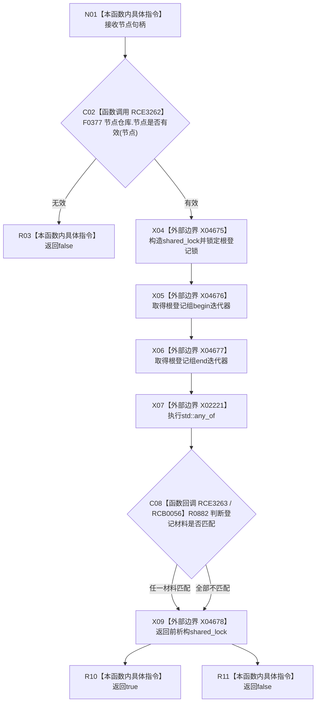

# CF-L5-0223 概念图服务节点是否已登记概念根现状流程图

图类型：现状流程图
代码版本：`0a93526882cb33c61c2fbb04ecad1aeaddcfe225`
工作区复核基线：`2089268fbb3833ebc77486169b98d8a14c49d508`
源码 blob：`dc4bd08f99622b3380c91dd15258fc8ab2e1b9c6`
覆盖文件：`海中鱼巣/领域/概念图服务.h:916-924`
唯一根函数：R0531
完整签名：`bool 海中鱼巣::概念图服务::节点是否已登记概念根(节点句柄 节点) const`
参数：节点按值传入；只读句柄
返回结果：节点无效时返回 `false`；否则在根登记共享锁内，只要存在一个有值且根节点相同的登记材料就返回 `true`
已登记调用方：F0177、F0178、F0179、F0180、F0362、F0370（RCE1636、RCE1642、RCE1648、RCE1654、RCE0127、RCE0154）
直接项目函数：F0377（RCE3262）、R0882（RCE3263；RCB0056）；R0882 内部经 RCE1691 调 F0051
外部边界：X02221、X04675—X04678；R0882 自身的 optional 边界为 X04679、X04680
逐行映射表：`流程图/代码流程图/L5/CF-L5-0223_概念图服务节点是否已登记概念根_逐行代码映射表.md`
结构读写：只读节点仓库有效性与根登记组
不得作为施工许可：是
不得宣称：返回 `true` 代表根登记材料之外的概念结构、活动图或业务闭环有效

## 流程图

## 当前边界

- 节点有效性检查发生在加根登记锁之前；无效输入不会读取根登记组。
- C08 是独立项目函数 R0882；其内部 optional 读取登记为 X04679、X04680，并经 RCE1691 调 F0051，不压入 R0531 根函数节点。
- R0531 只持有根登记共享锁并通过 X02221 调度 R0882，不直接比较登记材料中的节点句柄。
