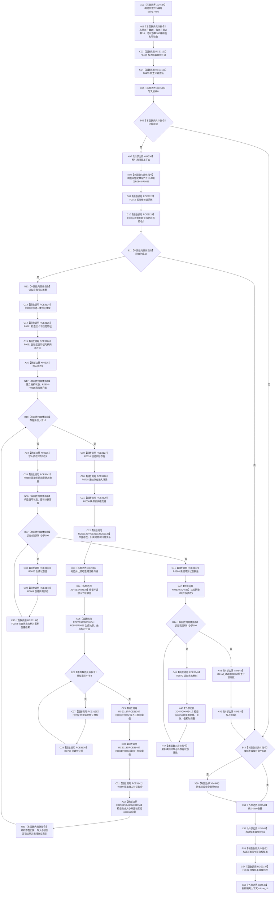

# CF-L5-0224 运行自我场景多存在特征状态自检现状流程图

图类型：现状流程图
代码版本：`03a8b7ac099ccea83e57f2696e2290b7bcdfacaf`
当前工作区复核基线：`4e0ac10ae3b18404ff2b623faa0fb006fa0fc7a1`
源码 blob：`59de05d5ba3594942c819c9ec50e3d0ebc6cb9bd`
覆盖文件：`海中鱼巣/自检.入口初始化.ixx:483-653`
唯一根函数：R0847
完整签名：`海中鱼巣::自检单元结果 海中鱼巣::运行自我场景多存在特征状态自检(const 海中鱼巣::入口初始化自检运行配置& 配置)`
参数：`配置` 为调用期间有效的只读非拥有借用
返回结果：固定编号 `ENTRY-ONLY-S15` 的七项自检单元结果；失败数为七项验收中的 false 数量
调用图：`流程图/主程序可达调用关系/00_main可达函数身份表.md`、`01_main可达项目调用边表.md`、`02_main可达外部边界表.md`
已登记调用方：R0858（RCE3119）
直接项目函数：F0468、F0469、F0015、F0016、R0560、R0561、F0051、F0516、R0738、F0050、R0277、F0168、F0579、R0855、R0856、R0762、R0763、R0860、R0862、R0861、R0863、R0859、R0868、R0869、F0163、R0870、R0857、F0131（RCE3120—RCE3147）
同步回调函数：F0015 通过端口调用 R0848—R0853；各闭包分别调用 F0043—F0046、F0048、F0050
外部边界：X04534—X04545、X04948—X04951
逐行映射表：`流程图/代码流程图/L5/CF-L5-0224_运行自我场景多存在特征状态自检_逐行代码映射表.md`
输入契约 / 调用语境表：本图内嵌；仅完整入口初始化自检模式调用
非成功返回二分审查表：环境或初始化失败、结构写读不一致形成自检失败；强制失败编号命中是具名测试故障注入
偏差清单：无独立文件；本批只记录冻结代码事实
验证输出：静态 Mermaid、节点集合、逐行覆盖和调用边闭合；未构建、未运行程序
不得作为施工许可：是
不得宣称：七项通过证明十个存在、三类特征与百个状态已形成生产业务能力或跨事务完整读回

## 流程图

## 当前边界

- 自检环境为隔离上下文；六个端口闭包只在 F0015 同步调用期间借用上下文。
- 三组特征写入、三组读回、百项状态创建与读回均折叠为七项布尔验收；false 只形成自检失败材料，不自动裁决根因。
- X04948—X04951 为本批补齐的标准库调用边界；日志、数量和图谱存在均不证明生产业务能力完成。
