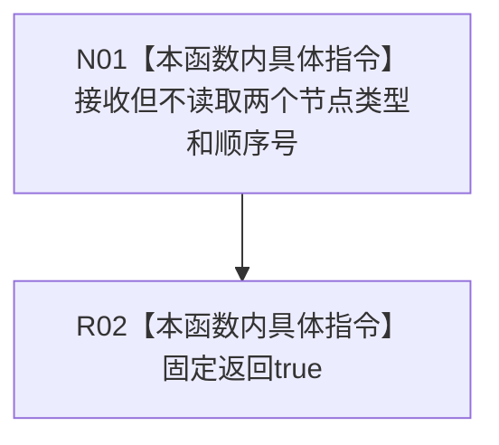

# CF-L5-0225 自检关系准入回调现状流程图

图类型：现状流程图
代码版本：`3242c16640da898b546f294199c00c08032ba49c`
源码 blob：`ef195168d944674fc4564530cef091c546c637fd`
覆盖文件：`海中鱼巣/领域/自检.节点直接世界结构骨架.ixx:35`
唯一根函数：R0899
完整签名：`bool 海中鱼巣::节点直接世界结构骨架自检内部::允许自检关系(节点类型, 节点类型, std::int64_t)`
参数：源节点类型、目标节点类型、顺序号，均按值传入且当前实现不读取
返回结果：固定返回 `true`
调用图：正式 main 可达关系表；由 R0900 形成函数指针并由正式关系仓库回调
逐行映射表：`流程图/代码流程图/L5/CF-L5-0225_自检关系准入回调_逐行代码映射表.md`
输入契约 / 调用语境表：仅自检准入表回调
非成功返回二分审查表：无非成功返回
偏差清单：仅自检用途，不得投影为生产准入规则
依据提交 / 结构化消息：`3242c166`；父任务 R0899 指派
验证输出：本批仅文档机械验证
不得作为施工许可：是
不得宣称：固定允许代表任何生产关系类型均可建立

## 流程图

## 当前边界

- 这是隔离自检的函数指针回调，不读取输入，不执行结构写入。
