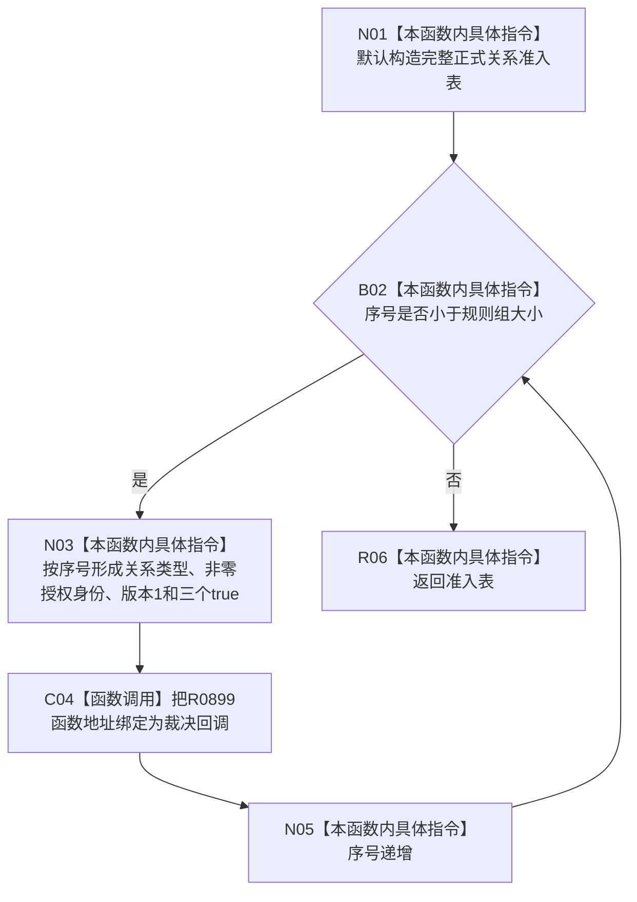

# CF-L5-0226 形成完整正式关系准入表现状流程图

图类型：现状流程图
代码版本：`3242c16640da898b546f294199c00c08032ba49c`
源码 blob：`ef195168d944674fc4564530cef091c546c637fd`
覆盖文件：`海中鱼巣/领域/自检.节点直接世界结构骨架.ixx:37-46`
唯一根函数：R0900
完整签名：`海中鱼巣::完整正式关系准入表 海中鱼巣::节点直接世界结构骨架自检内部::形成完整准入表()`
参数：无
返回结果：覆盖全部 ABI 关系类型的隔离自检准入表；每项绑定 R0899
调用图：正式 main 可达关系表；共享稳定边由顶层维护者收口
逐行映射表：`流程图/代码流程图/L5/CF-L5-0226_形成完整正式关系准入表_逐行代码映射表.md`
输入契约 / 调用语境表：仅 R0898 及同模块隔离自检构造正式关系仓库
非成功返回二分审查表：无非成功返回
偏差清单：自检准入表不是生产准入表
依据提交 / 结构化消息：`3242c166`；父任务 R0900 指派
验证输出：本批仅文档机械验证
不得作为施工许可：是
不得宣称：该表授权生产关系写入

## 流程图

## 当前边界

- 循环覆盖 `规则组.size()` 个条目；授权身份由固定基数加序号形成。
- 所有条目都允许同源多目标、同目标多来源和重挂，仅用于隔离自检。
