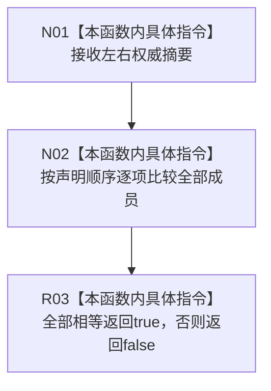

# CF-L5-0227 权威摘要等值比较现状流程图

图类型：现状流程图
代码版本：`3242c16640da898b546f294199c00c08032ba49c`
源码 blob：`ef195168d944674fc4564530cef091c546c637fd`
覆盖文件：`海中鱼巣/领域/自检.节点直接世界结构骨架.ixx:98`
唯一根函数：R0901
完整签名：`bool 海中鱼巣::节点直接世界结构骨架自检内部::operator==(const 权威摘要&, const 权威摘要&)`
参数：左右两个权威摘要，均为 const 引用
返回结果：编译器默认成员逐项等值结果
调用图：正式 main 可达关系表；由 R0898 比较调用前后摘要
逐行映射表：`流程图/代码流程图/L5/CF-L5-0227_权威摘要等值比较_逐行代码映射表.md`
输入契约 / 调用语境表：仅自检摘要比较
非成功返回二分审查表：`false` 是比较结果，不是业务失败
偏差清单：无
依据提交 / 结构化消息：`3242c166`；父任务 R0901 指派
验证输出：本批仅文档机械验证
不得作为施工许可：是
不得宣称：摘要相等证明摘要未覆盖的任何结构均未变化

## 流程图

## 当前边界

- 比较范围仅为 `权威摘要` 在 76-97 行声明的成员。
