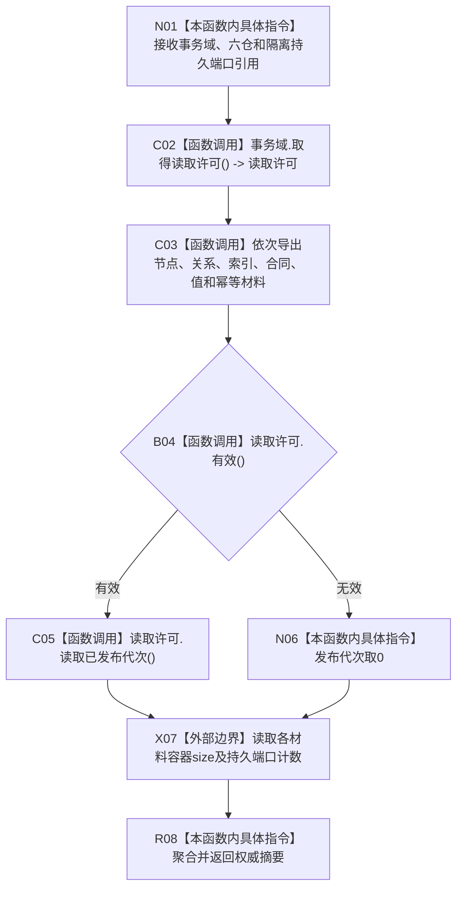

# CF-L5-0228 读取世界结构权威摘要现状流程图

图类型：现状流程图
代码版本：`3242c16640da898b546f294199c00c08032ba49c`
源码 blob：`ef195168d944674fc4564530cef091c546c637fd`
覆盖文件：`海中鱼巣/领域/自检.节点直接世界结构骨架.ixx:101-127`
唯一根函数：R0902
完整签名：`海中鱼巣::节点直接世界结构骨架自检内部::权威摘要 海中鱼巣::节点直接世界结构骨架自检内部::读取权威摘要(节点直接身份结构事务域&, 节点直接身份仓库&, 正式关系仓库&, 可重建索引仓库&, 节点直接类型合同仓库&, 节点直接类型化值仓库&, 节点直接事务幂等仓库&, const 隔离持久端口&)`
参数：七个仓库/事务域可变引用和隔离持久端口 const 引用；函数只读其当前材料
返回结果：发布代次、六仓材料计数和持久端口调用计数的值式摘要
调用图：正式 main 可达关系表；共享稳定边由顶层维护者收口
逐行映射表：`流程图/代码流程图/L5/CF-L5-0228_读取世界结构权威摘要_逐行代码映射表.md`
输入契约 / 调用语境表：R0898 在七个骨架调用前后各调用一次
非成功返回二分审查表：读取许可无效时把发布代次投影为0，不中途返回
偏差清单：摘要只覆盖代码列出的材料数量
依据提交 / 结构化消息：`3242c166`；父任务 R0902 指派
验证输出：本批仅文档机械验证
不得作为施工许可：是
不得宣称：摘要相等覆盖未被摘要字段枚举的全部状态

## 流程图

## 当前边界

- 函数不持久化摘要；仓库导出和读取许可的内部过程由各自函数承担。
- 读取许可无效只影响摘要中的发布代次字段。
