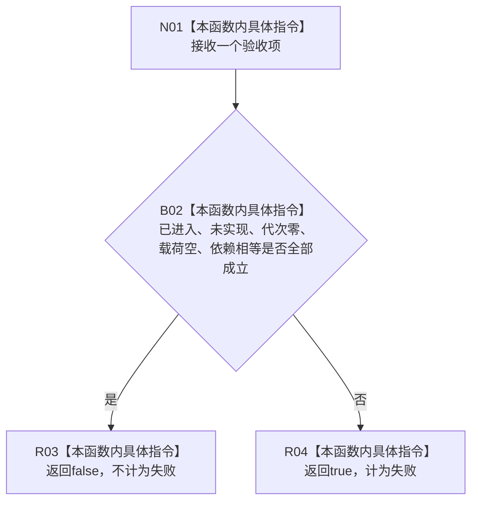

# CF-L5-0229 世界结构骨架失败项计数回调现状流程图

图类型：现状流程图
代码版本：`3242c16640da898b546f294199c00c08032ba49c`
源码 blob：`ef195168d944674fc4564530cef091c546c637fd`
覆盖文件：`海中鱼巣/领域/自检.节点直接世界结构骨架.ixx:223-226`
唯一根函数：R0903
完整签名：`bool 海中鱼巣::运行节点直接世界结构骨架自检()::<lambda@自检.节点直接世界结构骨架.ixx:223>::operator()(const 节点直接世界结构骨架函数验收& 项) const`
参数：验收项 const 引用；无捕获闭包
返回结果：任一验收条件不成立时返回 `true`，供 `std::count_if` 计为失败
调用图：正式 main 可达关系表；由 R0898 通过 `std::count_if` 回调
逐行映射表：`流程图/代码流程图/L5/CF-L5-0229_世界结构骨架失败项计数回调_逐行代码映射表.md`
输入契约 / 调用语境表：仅 R0898 验收组遍历
非成功返回二分审查表：`true` 表示失败项分类，不是业务返回
偏差清单：无
依据提交 / 结构化消息：`3242c166`；父任务 R0903 指派
验证输出：本批仅文档机械验证
不得作为施工许可：是
不得宣称：回调返回 false 证明业务能力完成

## 流程图

## 当前边界

- 无捕获、无副作用，只读取验收项五个布尔字段。
