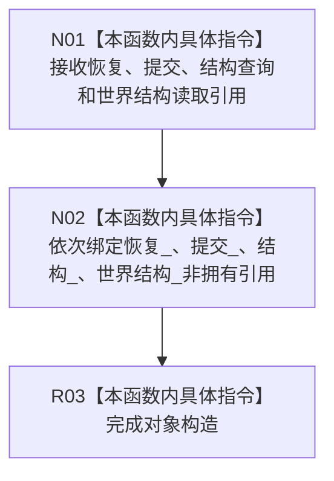

# CF-L5-0230 节点直接世界引导服务构造现状流程图

图类型：现状流程图
代码版本：`3242c16640da898b546f294199c00c08032ba49c`
源码 blob：`0fc5537a7f54ecc2996586b92e568b26cbe67f61`
覆盖文件：`海中鱼巣/领域/服务.节点直接世界引导.ixx:43-48`
唯一根函数：R0904
完整签名：`海中鱼巣::节点直接世界引导服务::节点直接世界引导服务(节点直接结构恢复服务&, 节点直接类型化结构提交服务&, 节点直接结构查询服务&, 节点直接世界结构读取服务&)`
参数：恢复、提交、结构查询、世界结构读取服务均为可变引用；调用方保证生命周期覆盖本服务
返回结果：构造函数，无独立返回值；保存四个非拥有引用
调用图：正式 main 可达关系表；无直接项目函数调用
逐行映射表：`流程图/代码流程图/L5/CF-L5-0230_节点直接世界引导服务构造_逐行代码映射表.md`
输入契约 / 调用语境表：R0898 使用局部服务对象构造
非成功返回二分审查表：`noexcept`，无显式失败返回
偏差清单：无；仅依赖绑定，不证明引导实现
依据提交 / 结构化消息：`3242c166`；父任务 R0904 指派
验证输出：本批仅文档机械验证
不得作为施工许可：是
不得宣称：依赖已绑定代表世界引导可执行

## 流程图

## 当前边界

- 不调用四个依赖，不读取或写入世界事实。
