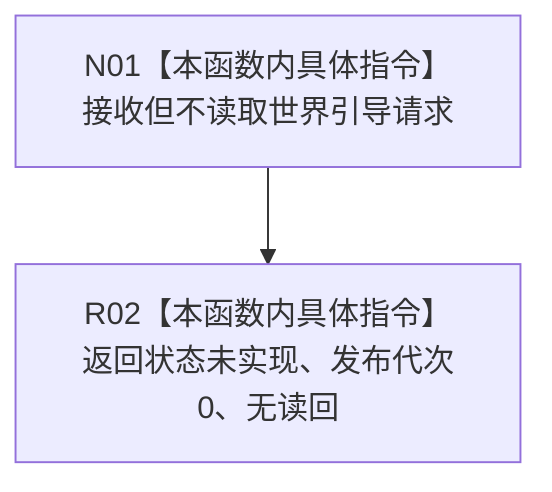

# CF-L5-0231 确保现实世界已引导现状流程图

图类型：现状流程图
代码版本：`3242c16640da898b546f294199c00c08032ba49c`
源码 blob：`0fc5537a7f54ecc2996586b92e568b26cbe67f61`
覆盖文件：`海中鱼巣/领域/服务.节点直接世界引导.ixx:50-53`
唯一根函数：R0905
完整签名：`海中鱼巣::节点直接世界引导结果 海中鱼巣::节点直接世界引导服务::确保现实世界已引导(const 节点直接世界引导请求&) const`
参数：请求 const 引用；当前骨架不读取任何字段
返回结果：固定 `{未实现, 0, nullopt}`
调用图：正式 main 可达关系表；无直接项目函数调用
逐行映射表：`流程图/代码流程图/L5/CF-L5-0231_确保现实世界已引导_逐行代码映射表.md`
输入契约 / 调用语境表：R0898 使用默认请求验证安全未实现合同
非成功返回二分审查表：固定 `未实现` 是当前骨架事实，不是业务成功或逻辑内完成
偏差清单：实现缺失由既有设计治理处理；本图不产生施工许可
依据提交 / 结构化消息：`3242c166`；父任务 R0905 指派
验证输出：本批仅文档机械验证
不得作为施工许可：是
不得宣称：现实世界已恢复、已创建或已引导

## 流程图

## 当前边界

- 不调用构造时绑定的恢复、提交、结构或世界结构服务；零机器事实变化。
