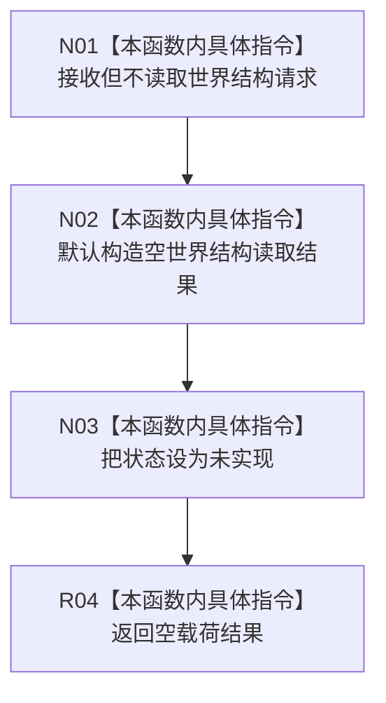

# CF-L5-0233 读取世界结构现状流程图

图类型：现状流程图
代码版本：`3242c16640da898b546f294199c00c08032ba49c`
源码 blob：`0caa5228428b89675ce61ab72a5d2aefbe455437`
覆盖文件：`海中鱼巣/领域/服务.节点直接世界结构.ixx:47-52`
唯一根函数：R0907
完整签名：`海中鱼巣::世界结构读取结果 海中鱼巣::节点直接世界结构读取服务::读取世界结构(const 节点直接世界结构读取请求&) const`
参数：请求 const 引用；当前骨架不读取任何字段
返回结果：默认空结果，仅把状态改为 `未实现`
调用图：正式 main 可达关系表；无直接项目函数调用
逐行映射表：`流程图/代码流程图/L5/CF-L5-0233_读取世界结构_逐行代码映射表.md`
输入契约 / 调用语境表：R0898 使用默认请求验证安全未实现合同
非成功返回二分审查表：固定未实现骨架
偏差清单：实现缺失由既有设计治理处理
依据提交 / 结构化消息：`3242c166`；父任务 R0907 指派
验证输出：本批仅文档机械验证
不得作为施工许可：是
不得宣称：读取到世界根、场景、存在或缺项

## 流程图

## 当前边界

- 不调用成员 `结构_`；事实截止代次保持0，世界根为默认值，各组为空。
