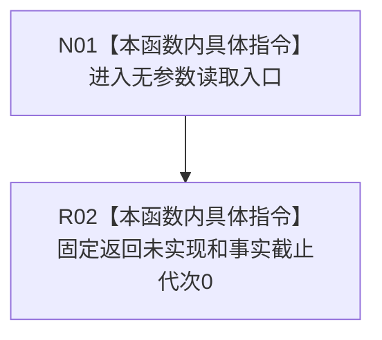

# CF-L5-0234 读取当前事实代次现状流程图

图类型：现状流程图
代码版本：`3242c16640da898b546f294199c00c08032ba49c`
源码 blob：`0caa5228428b89675ce61ab72a5d2aefbe455437`
覆盖文件：`海中鱼巣/领域/服务.节点直接世界结构.ixx:54-56`
唯一根函数：R0908
完整签名：`海中鱼巣::节点直接世界事实代次读取结果 海中鱼巣::节点直接世界结构读取服务::读取当前事实代次() const`
参数：无
返回结果：固定 `{未实现, 0}`
调用图：正式 main 可达关系表；无直接项目函数调用
逐行映射表：`流程图/代码流程图/L5/CF-L5-0234_读取当前事实代次_逐行代码映射表.md`
输入契约 / 调用语境表：R0898 验证安全未实现合同
非成功返回二分审查表：固定未实现骨架
偏差清单：实现缺失由既有设计治理处理
依据提交 / 结构化消息：`3242c166`；父任务 R0908 指派
验证输出：本批仅文档机械验证
不得作为施工许可：是
不得宣称：返回0代表权威事实代次确实为0

## 流程图

## 当前边界

- 不调用成员 `结构_`，0 是安全骨架占位值，不是权威代次读回。
