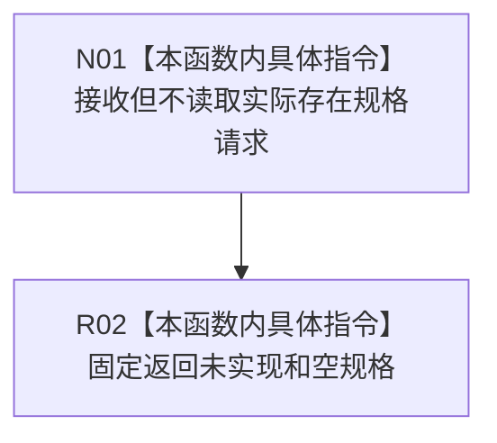

# CF-L5-0235 形成实际存在写入规格现状流程图

图类型：现状流程图
代码版本：`3242c16640da898b546f294199c00c08032ba49c`
源码 blob：`15bda0c92c9bb3cea6fa5e29226af891b4a6a3f7`
覆盖文件：`海中鱼巣/领域/服务.节点直接存在.ixx:32-35`
唯一根函数：R0909
完整签名：`海中鱼巣::节点直接实际存在规格结果 海中鱼巣::节点直接存在业务服务::形成实际存在写入规格(const 形成节点直接实际存在规格请求&) const`
参数：请求 const 引用；当前骨架不读取幂等身份或规则版本
返回结果：固定 `{未实现, nullopt}`
调用图：正式 main 可达关系表；无直接项目函数调用
逐行映射表：`流程图/代码流程图/L5/CF-L5-0235_形成实际存在写入规格_逐行代码映射表.md`
输入契约 / 调用语境表：R0898 使用默认请求验证安全未实现合同
非成功返回二分审查表：固定未实现骨架
偏差清单：实现缺失由既有设计治理处理
依据提交 / 结构化消息：`3242c166`；父任务 R0909 指派
验证输出：本批仅文档机械验证
不得作为施工许可：是
不得宣称：已形成任何实际存在写入规格

## 流程图

## 当前边界

- 不校验输入、不形成规格、不写机器事实。
