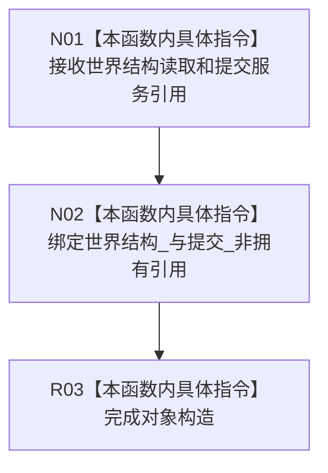

# CF-L5-0236 节点直接场景业务服务构造现状流程图

图类型：现状流程图
代码版本：`3242c16640da898b546f294199c00c08032ba49c`
源码 blob：`339a8d440d7a024dc5bc9ec7069070873ab75a6f`
覆盖文件：`海中鱼巣/领域/服务.节点直接场景.ixx:58-61`
唯一根函数：R0910
完整签名：`海中鱼巣::节点直接场景业务服务::节点直接场景业务服务(节点直接世界结构读取服务&, 节点直接类型化结构提交服务&)`
参数：世界结构读取服务和类型化结构提交服务可变引用；调用方保证生命周期覆盖本服务
返回结果：构造函数，无独立返回值；保存两个非拥有引用
调用图：正式 main 可达关系表；无直接项目函数调用
逐行映射表：`流程图/代码流程图/L5/CF-L5-0236_节点直接场景业务服务构造_逐行代码映射表.md`
输入契约 / 调用语境表：R0898 构造局部场景服务
非成功返回二分审查表：`noexcept`，无显式失败返回
偏差清单：无；仅依赖绑定
依据提交 / 结构化消息：`3242c166`；父任务 R0910 指派
验证输出：本批仅文档机械验证
不得作为施工许可：是
不得宣称：依赖绑定代表场景写入已实现

## 流程图

## 当前边界

- 构造时不调用两个依赖，不写场景或存在事实。
