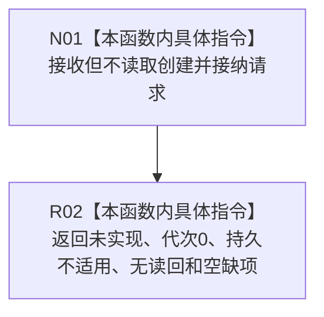

# CF-L5-0237 在已有场景中创建并接纳实际存在现状流程图

图类型：现状流程图
代码版本：`3242c16640da898b546f294199c00c08032ba49c`
源码 blob：`339a8d440d7a024dc5bc9ec7069070873ab75a6f`
覆盖文件：`海中鱼巣/领域/服务.节点直接场景.ixx:63-67`
唯一根函数：R0911
完整签名：`海中鱼巣::节点直接场景写入结果 海中鱼巣::节点直接场景业务服务::在已有场景中创建并接纳实际存在(const 节点直接场景创建并接纳请求&) const`
参数：请求 const 引用；当前骨架不读取请求头、场景见证或存在规格
返回结果：固定 `{未实现, 0, 不适用, nullopt, 空缺项组}`
调用图：正式 main 可达关系表；无直接项目函数调用
逐行映射表：`流程图/代码流程图/L5/CF-L5-0237_在已有场景中创建并接纳实际存在_逐行代码映射表.md`
输入契约 / 调用语境表：R0898 使用默认请求验证安全未实现合同
非成功返回二分审查表：固定未实现骨架
偏差清单：实现缺失由既有设计治理处理
依据提交 / 结构化消息：`3242c166`；父任务 R0911 指派
验证输出：本批仅文档机械验证
不得作为施工许可：是
不得宣称：创建、接纳、提交或发布了任何存在

## 流程图

## 当前边界

- 不调用世界结构读取或提交服务；零机器事实变化。
