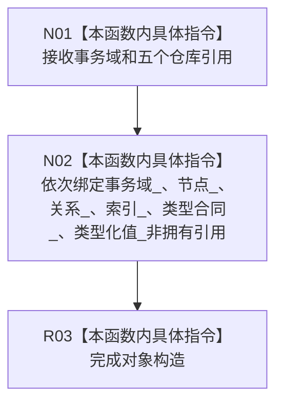

# CF-L5-0240 节点直接结构查询服务构造现状流程图

图类型：现状流程图
代码版本：`4b80f1617dd70ec7a19e1a34efa9da768dce8927`
源码 blob：`0aaded769655fd813862dee43f04646f3087ef80`
覆盖文件：`海中鱼巣/核心/服务.节点直接结构.ixx:32-40`
唯一根函数：R0914
完整签名：`海中鱼巣::节点直接结构查询服务::节点直接结构查询服务(节点直接身份结构事务域& 事务域, 节点直接身份仓库& 节点, 正式关系仓库& 关系, 可重建索引仓库& 索引, 节点直接类型合同仓库& 类型合同, 节点直接类型化值仓库& 类型化值)`
参数：事务域及节点、关系、索引、类型合同、类型化值六个依赖均为可变引用；调用方保证生命周期覆盖本服务
返回结果：构造函数，无独立返回值；保存六个非拥有引用
调用图：正式 main 可达关系表；无直接项目函数调用
逐行映射表：`流程图/代码流程图/L5/CF-L5-0240_节点直接结构查询服务构造_逐行代码映射表.md`
输入契约 / 调用语境表：R0898 与 P1A2Q 精确索引查询隔离夹具构造局部结构查询服务
非成功返回二分审查表：`noexcept`，无显式失败返回
偏差清单：无；仅依赖绑定
依据提交 / 结构化消息：冻结源码提交 `4b80f1617dd70ec7a19e1a34efa9da768dce8927`
验证输出：本批仅文档机械验证
不得作为施工许可：是
不得宣称：依赖绑定代表任一结构查询已执行或成功

## 流程图

## 当前边界

- 图与映射只消费已发布 blob `0aaded76...`；未读取或吸收当前工作区对此文件的 dirty。
- 构造时不取得读取许可、不读取仓库材料。
- Debug 故障自检字段的原子默认构造记入外部边界表，不改变本函数六个显式依赖引用的绑定顺序。
