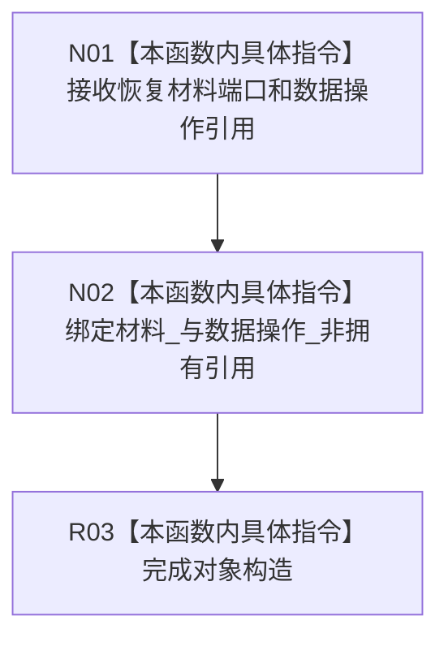

# CF-L5-0241 节点直接结构恢复服务构造现状流程图

图类型：现状流程图
代码版本：`3242c16640da898b546f294199c00c08032ba49c`
源码 blob：`9ee5c6d00952d92dc957605a4ba8c536e7ea4c42`
覆盖文件：`海中鱼巣/核心/服务.节点直接结构恢复.ixx:15-18`
唯一根函数：R0915
完整签名：`海中鱼巣::节点直接结构恢复服务::节点直接结构恢复服务(节点直接恢复材料读取端口&, 节点直接类型化结构数据操作&)`
参数：恢复材料读取端口和类型化结构数据操作可变引用；调用方保证生命周期覆盖本服务
返回结果：构造函数，无独立返回值；保存两个非拥有引用
调用图：正式 main 可达关系表；无直接项目函数调用
逐行映射表：`流程图/代码流程图/L5/CF-L5-0241_节点直接结构恢复服务构造_逐行代码映射表.md`
输入契约 / 调用语境表：R0898 构造局部恢复服务
非成功返回二分审查表：`noexcept`，无显式失败返回
偏差清单：无；仅依赖绑定
依据提交 / 结构化消息：`3242c166`；父任务 R0915 指派
验证输出：本批仅文档机械验证
不得作为施工许可：是
不得宣称：依赖绑定代表安装实例恢复已执行或成功

## 流程图

## 当前边界

- 构造时不读取安装实例材料，不调用恢复数据操作。
