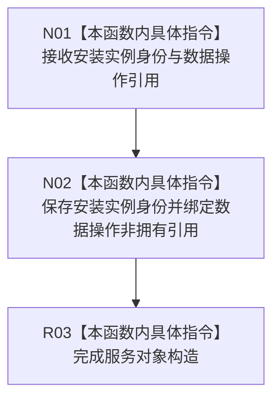

# CF-L5-0245 节点直接类型化结构提交服务构造现状流程图

图类型：现状流程图
代码版本：`4b80f1617dd70ec7a19e1a34efa9da768dce8927`
源码 blob：`81436fae9c0952071918e5353ece369150ec1fef`
覆盖文件：`海中鱼巣/核心/服务.节点直接类型化结构提交.ixx:14-17`
唯一根函数：R1090
完整签名：`海中鱼巣::节点直接类型化结构提交服务::节点直接类型化结构提交服务(节点直接事务幂等身份 安装实例身份, 节点直接类型化结构数据操作& 数据操作)`
参数：安装实例身份按值；数据操作为非拥有可变引用，调用方保证其生命周期覆盖服务对象
返回结果：构造函数，无独立返回值；保存安装实例身份和数据操作引用
调用图：正式 main 可达关系表；无直接项目函数调用
逐行映射表：`流程图/代码流程图/L5/CF-L5-0245_节点直接类型化结构提交服务_逐行代码映射表.md`
输入契约 / 调用语境表：R0898、R1118 构造服务
非成功返回二分审查表：无显式失败返回
偏差清单：无；仅依赖与身份绑定
依据提交 / 结构化消息：`4b80f161`
验证输出：本批仅文档机械验证
不得作为施工许可：是
不得宣称：构造服务代表类型化结构事务已提交或持久见证已完成

## 流程图

## 当前边界

- 构造过程不探测幂等、不提交事务，也不读取或写入持久证据。
