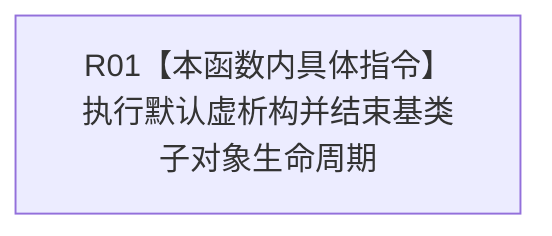

# CF-L5-0246 节点直接持久证据写入端口析构现状流程图

图类型：现状流程图
代码版本：`4b80f1617dd70ec7a19e1a34efa9da768dce8927`
源码 blob：`da8d7a8f2fee5f23fc76b09dadb4de118fcc8ede`
覆盖文件：`海中鱼巣/核心/端口.节点直接持久证据.ixx:51`
唯一根函数：R1093
完整签名：`海中鱼巣::节点直接持久证据写入端口::~节点直接持久证据写入端口()`
参数：隐式 this；无显式参数
返回结果：析构函数，无返回值；基类析构为虚、默认实现
调用图：正式 main 可达关系表；无直接项目函数调用
逐行映射表：`流程图/代码流程图/L5/CF-L5-0246_节点直接持久证据写入端口_逐行代码映射表.md`
输入契约 / 调用语境表：R0898、R1118 的端口对象生命周期结束
非成功返回二分审查表：无显式失败返回
偏差清单：无
依据提交 / 结构化消息：`4b80f161`
验证输出：本批仅文档机械验证
不得作为施工许可：是
不得宣称：基类析构代表具体持久资源已经写入、撤销或验证

## 流程图

## 当前边界

- 本函数没有显式持久写入、撤销或诊断逻辑；具体派生类资源释放不在本函数源码内展开。
