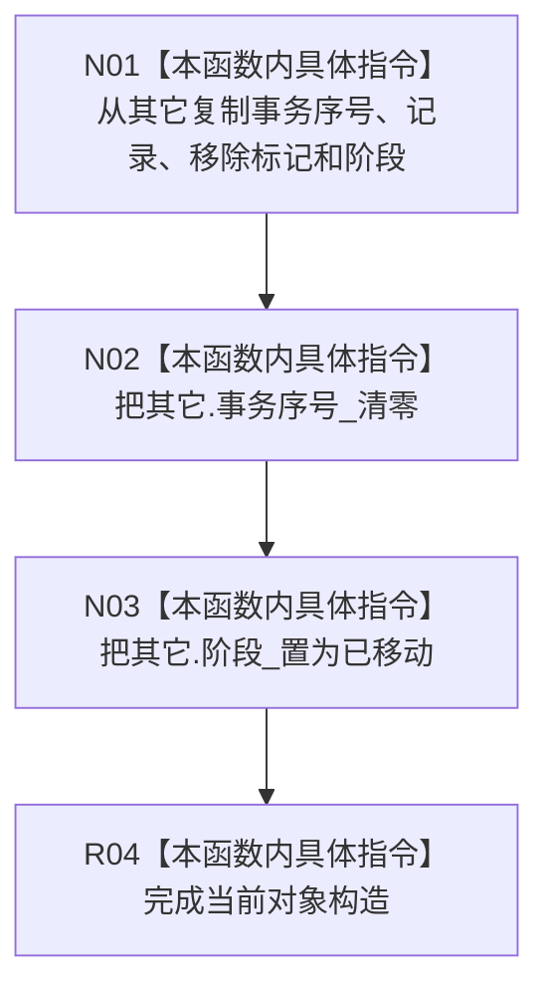

# CF-L5-0259 可重建索引候选移动构造现状流程图

图类型：现状流程图
代码版本：`4b80f1617dd70ec7a19e1a34efa9da768dce8927`；在 HEAD `466d1ab0272ebb122203354a2a1e7be893db964a` 复核目标源码 blob 未变
源码 blob：`e2d8ebd62dc85563118b4fe246377d5445bf977c`
覆盖文件：`海中鱼巣/核心/仓库.可重建索引.ixx:75-79`
唯一根函数：R1156
完整签名：`海中鱼巣::可重建索引候选::可重建索引候选(可重建索引候选&& 其它) noexcept`
参数：`其它` 为将被消费的右值候选；构造后仍可析构但不再代表有效持有者
返回结果：构造当前候选对象；无返回值
调用图：正式关系表仅登记 R0897 构造 / 容器实例化链前驱；本函数无直接项目调用或外部边界
逐行映射表：`流程图/代码流程图/L5/CF-L5-0259_可重建索引候选_逐行代码映射表.md`
输入契约 / 调用语境表：候选需要转移到可选值或其它唯一持有位置时调用
非成功返回二分审查表：`noexcept`，无显式非成功返回
偏差清单：无
依据提交 / 结构化消息：`4b80f161` 图谱基线；`466d1ab0` 目标文件零漂移复核
验证输出：本批仅源码逐行与 Markdown 机械验证
不得作为施工许可：是
不得宣称：移动候选代表候选已确认、发布或撤销

## 流程图

## 当前边界

- `记录_` 按当前源码复制，不是 `std::move`；源候选的记录和移除标记仍保留，但事务序号清零且阶段变为已移动。
