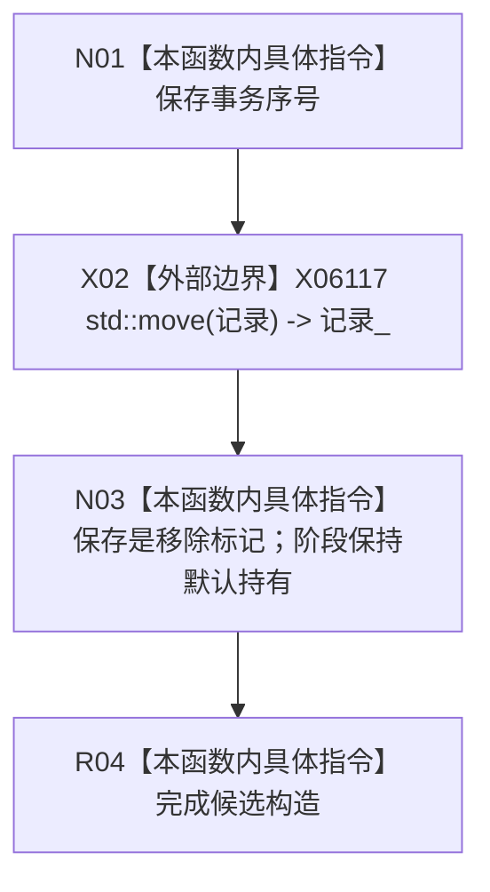

# CF-L5-0260 可重建索引候选构造现状流程图

图类型：现状流程图
代码版本：`4b80f1617dd70ec7a19e1a34efa9da768dce8927`；在 HEAD `466d1ab0272ebb122203354a2a1e7be893db964a` 复核目标源码 blob 未变
源码 blob：`e2d8ebd62dc85563118b4fe246377d5445bf977c`
覆盖文件：`海中鱼巣/核心/仓库.可重建索引.ixx:88-90`
唯一根函数：R1158
完整签名：`海中鱼巣::可重建索引候选::可重建索引候选(std::uint64_t 事务序号, 可重建索引记录 记录, bool 是移除 = false) noexcept`
参数：`事务序号` 按值；`记录` 按值并移动进对象；`是移除` 按值，默认 `false`
返回结果：构造阶段默认为“持有”的候选对象；无返回值
调用图：R1163 在 218 行经 RCE4151、R1164 在 253 行经 RCE4555 显式构造本对象；外部边界 X06117 `std::move`
逐行映射表：`流程图/代码流程图/L5/CF-L5-0260_可重建索引候选_逐行代码映射表.md`
输入契约 / 调用语境表：仓库已完成入口检查后，为创建或移除操作形成唯一候选
非成功返回二分审查表：`noexcept`，无显式非成功返回
偏差清单：R1163:218、R1164:253 到 R1158 的显式构造调用已分别登记为 RCE4151、RCE4555
依据提交 / 结构化消息：`4b80f161` 图谱基线；`466d1ab0` 目标文件零漂移复核
验证输出：本批仅源码逐行与 Markdown 机械验证
不得作为施工许可：是
不得宣称：候选对象形成代表正向或反向绑定已发布

## 流程图

## 当前边界

- 构造函数不复核事务序号或记录完整性；这些前置由调用方承担。
