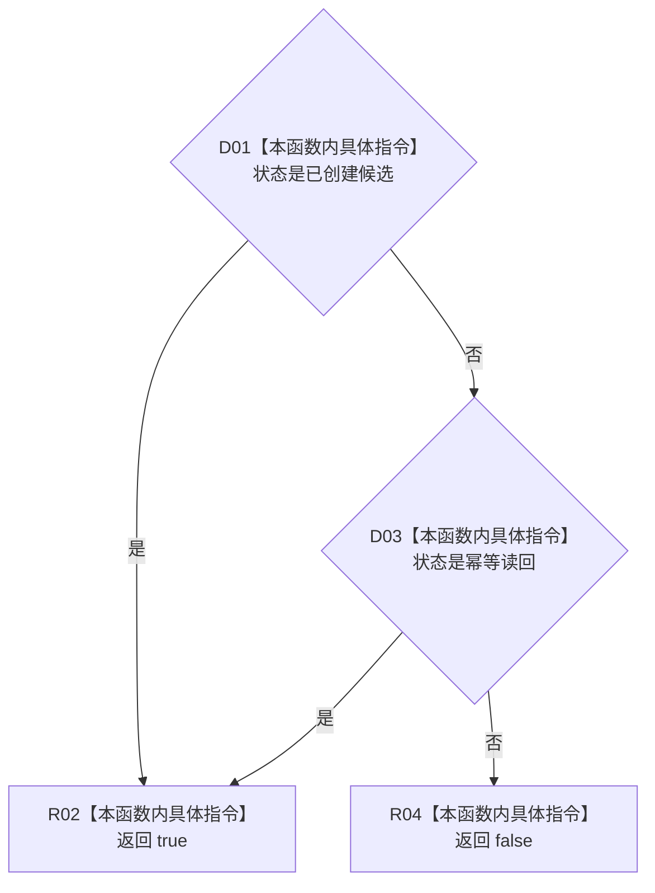

# CF-L5-0261 成功谓词现状流程图

图类型：现状流程图
代码版本：`4b80f1617dd70ec7a19e1a34efa9da768dce8927`；在 HEAD `466d1ab0272ebb122203354a2a1e7be893db964a` 复核目标源码 blob 未变
源码 blob：`e2d8ebd62dc85563118b4fe246377d5445bf977c`
覆盖文件：`海中鱼巣/核心/仓库.可重建索引.ixx:102-105`
唯一根函数：R1159
完整签名：`bool 海中鱼巣::可重建索引写入结果::成功() const noexcept`
参数：隐式 `this` 为只读借用；无显式参数
返回结果：状态为“已创建候选”或“幂等读回”时返回 `true`，其它状态返回 `false`
调用图：R0897 验证链可达；R1159 无直接被调函数
逐行映射表：`流程图/代码流程图/L5/CF-L5-0261_成功_逐行代码映射表.md`
输入契约 / 调用语境表：调用方已取得可重建索引写入结果，查询其成功口径
非成功返回二分审查表：`false` 只是结果状态投影；具体逻辑内返回或内部错误由 `状态` 枚举值决定
偏差清单：无
依据提交 / 结构化消息：`4b80f161` 图谱基线；`466d1ab0` 目标文件零漂移复核
验证输出：本批仅源码逐行与 Markdown 机械验证
不得作为施工许可：是
不得宣称：`true` 代表候选已经确认或发布

## 流程图

## 当前边界

- “已确认待发布”“已发布”并不在本谓词的成功集合内；本函数只表达创建入口的成功口径。
