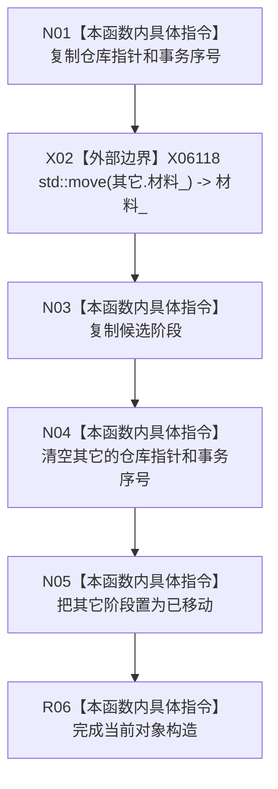

# CF-L5-0262 可重建索引恢复候选移动构造现状流程图

图类型：现状流程图
代码版本：`4b80f1617dd70ec7a19e1a34efa9da768dce8927`；在 HEAD `466d1ab0272ebb122203354a2a1e7be893db964a` 复核目标源码 blob 未变
源码 blob：`e2d8ebd62dc85563118b4fe246377d5445bf977c`
覆盖文件：`海中鱼巣/核心/仓库.可重建索引.ixx:141-144`
唯一根函数：R1160
完整签名：`海中鱼巣::可重建索引恢复候选::可重建索引恢复候选(可重建索引恢复候选&& 其它) noexcept`
参数：`其它` 为将被消费的右值恢复候选；构造后仍可析构但不再代表有效持有者
返回结果：构造当前恢复候选对象；无返回值
调用图：正式关系表以 R0897 的自检聚合调用点提供可达证据；外部边界 X06118 `std::move`
逐行映射表：`流程图/代码流程图/L5/CF-L5-0262_可重建索引恢复候选_逐行代码映射表.md`
输入契约 / 调用语境表：恢复候选从临时结果转移到唯一持有位置时调用
非成功返回二分审查表：`noexcept`，无显式非成功返回
偏差清单：RCE4153 的 1496-1499 是聚合自检可达证据，不是本移动构造的精确直接调用点
依据提交 / 结构化消息：`4b80f161` 图谱基线；`466d1ab0` 目标文件零漂移复核
验证输出：本批仅源码逐行与 Markdown 机械验证
不得作为施工许可：是
不得宣称：移动恢复候选代表恢复材料已确认或发布

## 流程图

## 当前边界

- 源候选的材料被移动；源候选的仓库指针、事务序号和阶段被显式失效化。
