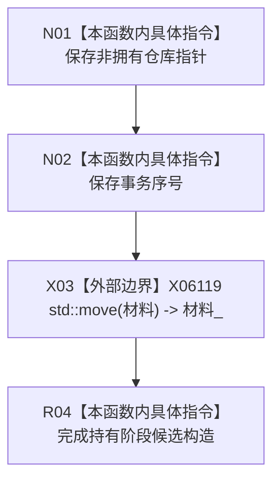

# CF-L5-0263 可重建索引恢复候选构造现状流程图

图类型：现状流程图
代码版本：`4b80f1617dd70ec7a19e1a34efa9da768dce8927`；在 HEAD `466d1ab0272ebb122203354a2a1e7be893db964a` 复核目标源码 blob 未变
源码 blob：`e2d8ebd62dc85563118b4fe246377d5445bf977c`
覆盖文件：`海中鱼巣/核心/仓库.可重建索引.ixx:149-150`
唯一根函数：R1161
完整签名：`海中鱼巣::可重建索引恢复候选::可重建索引恢复候选(可重建索引仓库* 仓库, std::uint64_t 事务序号, 可重建索引权威材料 材料)`
参数：`仓库` 为非拥有指针且必须覆盖候选生命周期；`事务序号` 按值；`材料` 按值并移动进对象
返回结果：构造阶段默认为“持有”的恢复候选；无返回值
调用图：R1174 在 492 行显式构造 R1161；外部边界 X06119 `std::move`
逐行映射表：`流程图/代码流程图/L5/CF-L5-0263_可重建索引恢复候选_逐行代码映射表.md`
输入契约 / 调用语境表：仓库已接受完整恢复材料并占用恢复事务序号后形成候选
非成功返回二分审查表：无显式非成功返回；材料移动或外层可选值构造异常由调用方处理
偏差清单：正式边表未登记 R1174:492 -> R1161 的显式构造边；RCE4154 的 1496-1499 仅是聚合自检可达证据
依据提交 / 结构化消息：`4b80f161` 图谱基线；`466d1ab0` 目标文件零漂移复核
验证输出：本批仅源码逐行与 Markdown 机械验证
不得作为施工许可：是
不得宣称：恢复候选形成代表恢复结构已发布

## 流程图

## 当前边界

- 构造函数不检查空仓库指针、零事务序号或材料完整性；调用方必须先完成这些前置。
