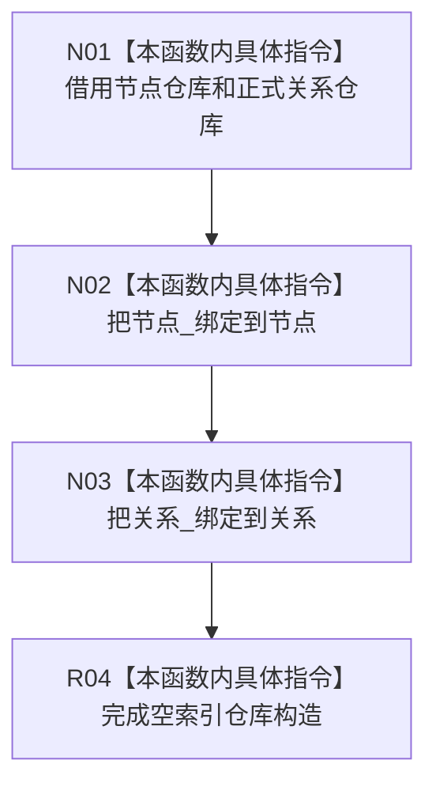

# CF-L5-0264 可重建索引仓库构造现状流程图

图类型：现状流程图
代码版本：`4b80f1617dd70ec7a19e1a34efa9da768dce8927`；在 HEAD `466d1ab0272ebb122203354a2a1e7be893db964a` 复核目标源码 blob 未变
源码 blob：`e2d8ebd62dc85563118b4fe246377d5445bf977c`
覆盖文件：`海中鱼巣/核心/仓库.可重建索引.ixx:164-168`
唯一根函数：R1162
完整签名：`海中鱼巣::可重建索引仓库::可重建索引仓库(const 节点直接身份仓库& 节点, const 正式关系仓库& 关系)`
参数：`节点`、`关系` 均为只读非拥有引用；两个被引用仓库必须覆盖本仓库生命周期
返回结果：构造持有两个只读仓库引用、空索引映射和零恢复事务序号的仓库对象；无返回值
调用图：R1118、R1149、R1150、R0897 子调用链、R1471、R0898 构造可达；本函数无直接被调函数
逐行映射表：`流程图/代码流程图/L5/CF-L5-0264_可重建索引仓库_逐行代码映射表.md`
输入契约 / 调用语境表：装配或自检夹具在节点、关系仓库已经构造后建立可重建索引仓库
非成功返回二分审查表：无显式非成功返回
偏差清单：RCE4155 的 1496-1499 是聚合自检函数调用点，不是 R1162 的精确构造点；其它入边行号需在相应调用方冻结 blob 上复核
依据提交 / 结构化消息：`4b80f161` 图谱基线；`466d1ab0` 目标文件零漂移复核
验证输出：本批仅源码逐行与 Markdown 机械验证
不得作为施工许可：是
不得宣称：仓库构造代表索引已有数据、已恢复或已发布

## 流程图

## 当前边界

- 构造函数不复制上游仓库，也不读取或重建任何索引记录。
