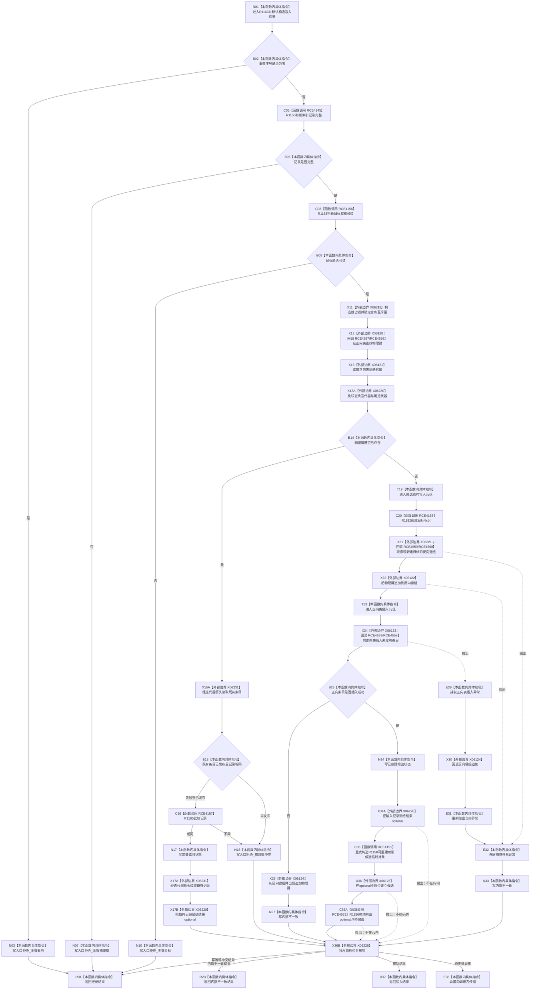

# CF-L5-0265 `可重建索引仓库::结构化创建索引候选` 现状流程图

图类型：现状流程图
代码版本：`4b80f1617dd70ec7a19e1a34efa9da768dce8927`；在 HEAD `c55870c1247101f8b57177d45c96c84fd1109b0f` 复核目标源码 blob 未变
源码 blob：`e2d8ebd62dc85563118b4fe246377d5445bf977c`
覆盖文件：`海中鱼巣/核心/仓库.可重建索引.ixx:170-220`
唯一根函数：R1163
完整签名：`可重建索引写入结果 海中鱼巣::可重建索引仓库::结构化创建索引候选(可重建索引记录 记录, std::uint64_t 事务序号)`
参数：`记录` 按值持有待建立的索引记录；`事务序号` 按值标识候选所属事务，零值被拒绝
返回结果：拒绝时返回具名入口状态；已发布相同记录时幂等读回；新建成功时返回当前记录和未发布候选；容器插入或异常路径返回内部不一致
已登记调用方：R1006（RCE3581）、R1248（RCE4025）、R1484（RCE4441）
直接项目函数：R1155（RCE4145）、R1183（RCE4156）、R1185（RCE4157）、R1182（RCE4158）、R1158（RCE4151）；正向表调用 R1179/R1291 哈希与等值回调（RCE4557/RCE4558），反向表调用 R1181/R1180 哈希与等值回调（RCE4559/RCE4560）；218 行 optional 原位建立期间隐式调用 R1156 移动构造（RCE4563）。RCE4375、RCE4377 把 205 行状态赋值误记为 R1440/R1441 调用，均不是当前代码事实
外部边界：X06219 独占锁构造、X06120/X06121 正向表 `find/end`、X06230 迭代器不等比较、X06231 迭代器箭头访问、X06220 当前记录 optional 赋值、X06221 反向表 `operator[]`、X06122/X06124 向量 `push_back/pop_back`、X06123 正向表 `emplace`、X06125 候选 optional `emplace`、X06228 独占锁析构
逐行映射表：`流程图/代码流程图/L5/CF-L5-0265_结构化创建索引候选_逐行代码映射表.md`
输入契约 / 调用语境表：调用方提供候选记录和事务序号；本函数自行复核记录完整性与目标权威可读性
非成功返回二分审查表：零事务、记录不完整、目标不可读和物理键冲突均在正向结构写入前返回；插入失败和异常属于内部不一致
偏差清单：RCE4375/RCE4377 已删除；R1163 的直接构造、隐式移动构造、容器回调和外部边界均已用稳定 ID 闭合
依据提交 / 结构化消息：`4b80f161` 图谱代码基线；`c55870c1` 目标源码 blob 零漂移复核
验证输出：本批仅源码逐行、Mermaid 节点与 Markdown 机械验证
不得作为施工许可：是
不得宣称：返回已创建候选等于记录已经发布，或异常回滚已删除可能新建的空反向表条目

## 流程图

## 当前边界

- 反向表 `operator[]` 可能先建立空键组；随后 `push_back` 抛出时外层仅返回内部不一致，不删除这个空条目。
- 正向表插入失败或抛出时会回退刚追加的反向键，但不会清理已经存在或刚建立的空键组。
- 216—218 行已经离开 try/catch；结果 optional 赋值或候选 `emplace` 抛出的异常向上传播。
