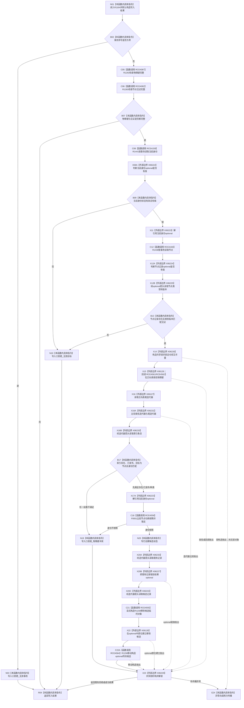

# CF-L5-0266 `可重建索引仓库::结构化移除索引候选` 现状流程图

图类型：现状流程图
代码版本：`4b80f1617dd70ec7a19e1a34efa9da768dce8927`；在 HEAD `c55870c1247101f8b57177d45c96c84fd1109b0f` 复核目标源码 blob 未变
源码 blob：`e2d8ebd62dc85563118b4fe246377d5445bf977c`
覆盖文件：`海中鱼巣/核心/仓库.可重建索引.ixx:222-255`
唯一根函数：R1164
完整签名：`可重建索引写入结果 海中鱼巣::可重建索引仓库::结构化移除索引候选(const 索引物理键& 键, const 节点稳定身份见证& 预期目标, std::uint64_t 事务序号)`
参数：`键`、`预期目标` 均为只读借用；`事务序号` 按值参与节点权威读回，零值被拒绝
返回结果：入口无效、目标权威读回不匹配或既有索引不满足移除前置时返回拒绝结果；前置满足时返回当前记录和标记为移除的未发布候选
已登记调用方：R1006（RCE3582）、R0897（RCE4161）、R1484（RCE4443）
直接项目函数：R1292（RCE4087）、R1283（RCE4082）、R1441（RCE4159）、R1438（RCE4160）、F0051（RCE4556）、R1158（RCE4555）；正向表调用 R1179/R1291 哈希与等值回调（RCE4561/RCE4562）；253 行 optional 原位建立期间隐式调用 R1156 移动构造（RCE4564）
外部边界：X06222/X06223 当前身份 optional 存在性与解引用、X06224/X06225 节点记录 optional 存在性与箭头访问、X06226/X06229 共享锁构造与析构、X06126/X06127 正向表 `find/end`、X06232 迭代器相等比较、X06233 迭代器箭头访问、X06227 当前记录 optional 赋值、X06128 候选 optional `emplace`
逐行映射表：`流程图/代码流程图/L5/CF-L5-0266_结构化移除索引候选_逐行代码映射表.md`
输入契约 / 调用语境表：调用方提供期望节点见证；本函数从节点仓库独立读回当前身份与记录后才读取索引仓库
非成功返回二分审查表：零事务、无效键/见证、目标无效、节点版本或类型不符、索引不存在/未发布/目标错配均在结构变化前返回
偏差清单：RCE4082/RCE4087 调用点、RCE4159/RCE4160 端点已校正；F0051、R1158、R1156、容器回调和外部边界均已用稳定 ID 闭合
依据提交 / 结构化消息：`4b80f161` 图谱代码基线；`c55870c1` 目标源码 blob 零漂移复核
验证输出：本批仅源码逐行、Mermaid 节点与 Markdown 机械验证
不得作为施工许可：是
不得宣称：返回已创建候选等于索引已经移除或候选已经发布

## 流程图

## 当前边界

- 231—242 行只读节点仓库并复核当前身份、类型和版本；所有拒绝路径均未改变索引仓结构。
- 243 行共享锁之后仍只读正向表；成功路径只形成返回值中的移除候选，不删除或改写既有索引条目。
- 本函数不捕获锁、容器查找、optional 访问或候选构造异常，异常直接向上传播。
