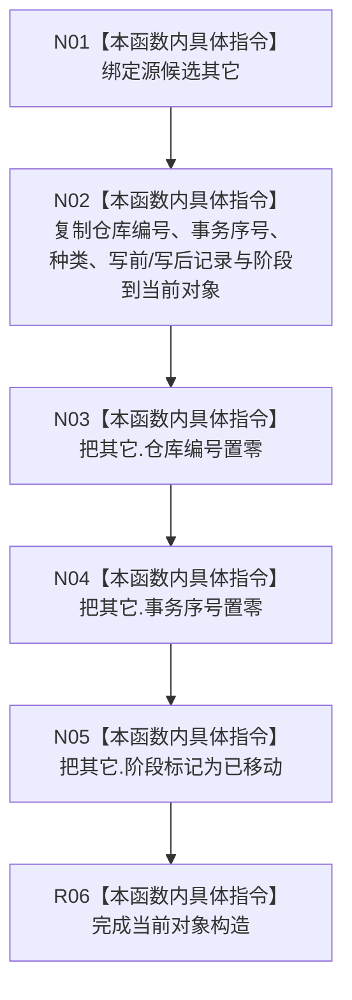

# CF-L5-0280 正式关系候选移动构造现状流程图

图类型：现状流程图
代码版本：`4b80f1617dd70ec7a19e1a34efa9da768dce8927`
源码 blob：`89248cb1a21b2d49b000f92400990bb2c36ea6bc`
覆盖文件：`海中鱼巣/核心/仓库.正式关系.ixx:129-135`
唯一根函数：R1191
完整签名：`海中鱼巣::正式关系候选::正式关系候选(正式关系候选&& 其它)`
参数：`其它` 为待转移的右值引用；构造期间可修改，生命周期由调用方持有
返回结果：构造函数，无独立返回值；当前对象取得其它对象各成员的副本，源对象的仓库编号和事务序号归零、阶段改为已移动
调用图：`4b80f161` 冻结源码由 R1203（RCE4546，348—349）、R1240（RCE4547，990—991）的 `optional::emplace`、R1265（RCE4548，331、334）的局部/写集移动，以及 R1006（RCE4549，1837、2831）的关系候选组 `push_back` 触发；泛化边 RCE3916 已删除；本函数无直接项目函数调用和显式外部边界
逐行映射表：`流程图/代码流程图/L5/CF-L5-0280_正式关系候选_逐行代码映射表.md`
输入契约 / 调用语境表：仓库结果 optional、写入会话写集和执行器候选组转移正式关系候选
非成功返回二分审查表：`noexcept`，无显式失败返回
偏差清单：泛化边 RCE3916 已删除；R1203、R1240、R1265、R1006 的精确直接入边已登记为 RCE4546—RCE4549
依据提交 / 结构化消息：`4b80f161`；正式身份 R1191、稳定入边 RCE4546—RCE4549
验证输出：本批仅源码、关系表、Mermaid 和逐行覆盖机械验证
不得作为施工许可：是
不得宣称：移动构造代表候选已确认、发布或撤销

## 流程图

## 当前边界

- 写前记录和写后记录按当前代码复制到新对象；源对象依靠编号归零和阶段 `已移动` 失去可继续提交语义。
