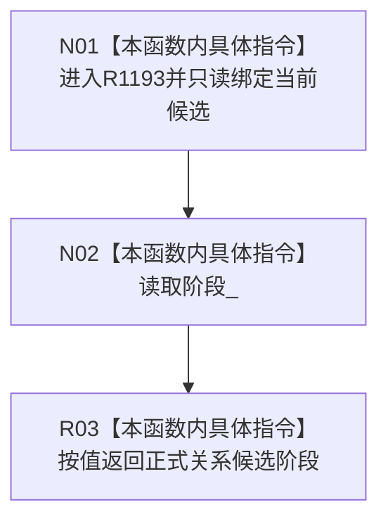

# CF-L5-0281 读取正式关系候选阶段现状流程图

图类型：现状流程图
代码版本：`4b80f1617dd70ec7a19e1a34efa9da768dce8927`
源码 blob：`89248cb1a21b2d49b000f92400990bb2c36ea6bc`
覆盖文件：`海中鱼巣/核心/仓库.正式关系.ixx:140`
唯一根函数：R1193
完整签名：`正式关系候选阶段 海中鱼巣::正式关系候选::读取阶段() const`
参数：无显式参数；只读访问当前正式关系候选
返回结果：按值返回候选的 `阶段_`
调用图：按 `4b80f161` 冻结源码，R1015 在执行器 1887 调用，R1147 在自检 957、977 调用；RCE3640、RCE3828 保持既有端点与调用点，RCE3918 的 R0897:1496—1499 泛化边已删除；本函数无直接项目函数调用和外部边界
逐行映射表：`流程图/代码流程图/L5/CF-L5-0281_读取阶段_逐行代码映射表.md`
输入契约 / 调用语境表：执行器发布后检查关系候选组，自检在两次完成发布后读取候选阶段
非成功返回二分审查表：无判断和非成功分支
偏差清单：RCE3918 泛化边已删除；较新 HEAD 的调用者身份与行号漂移不混入本冻结基线
依据提交 / 结构化消息：`4b80f161`；正式身份 R1193、稳定入边 RCE3640/RCE3828
验证输出：本批仅源码、关系表、Mermaid 和逐行覆盖机械验证
不得作为施工许可：是
不得宣称：读取阶段本身推进、确认、发布或撤销候选

## 流程图

## 当前边界

- 本访问器只投影当前阶段，不验证阶段迁移是否合法。
