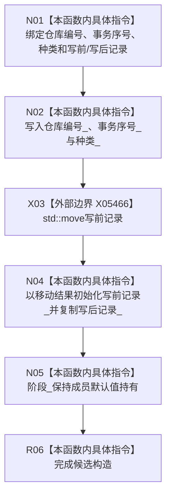

# CF-L5-0282 正式关系候选构造现状流程图

图类型：现状流程图
代码版本：`4b80f1617dd70ec7a19e1a34efa9da768dce8927`
源码 blob：`89248cb1a21b2d49b000f92400990bb2c36ea6bc`
覆盖文件：`海中鱼巣/核心/仓库.正式关系.ixx:146-154`
唯一根函数：R1195
完整签名：`海中鱼巣::正式关系候选::正式关系候选(std::uint64_t 仓库编号, std::uint64_t 事务序号, 正式关系候选种类 种类, std::optional<正式关系记录> 写前记录, 正式关系记录 写后记录)`
参数：仓库编号、事务序号和种类按值传入；写前记录和写后记录按值传入，写前记录随后移动到成员
返回结果：构造函数，无独立返回值；形成阶段默认为持有的正式关系候选
调用图：当前源码由 R1203 在 348—349、R1240 在 990—991 构造；共享项目边表尚未登记这两条精确边，原 RCE3921 的 R0897 泛化端点不对应直接源码调用；外部边界 X05466 `std::move`
逐行映射表：`流程图/代码流程图/L5/CF-L5-0282_正式关系候选_逐行代码映射表.md`
输入契约 / 调用语境表：正式关系仓库创建新关系候选或形成已发布关系变更候选时构造
非成功返回二分审查表：`noexcept`，无显式失败返回
偏差清单：项目入边需由共享关系维护者按当前源码校正
依据提交 / 结构化消息：`466d1ab0`；正式身份 R1195、待校正边 RCE3921、边界 X05466
验证输出：本批仅源码、关系表、Mermaid 和逐行覆盖机械验证
不得作为施工许可：是
不得宣称：候选构造代表候选已确认、发布或持久化

## 流程图

## 当前边界

- 构造函数只建立未发布候选载荷；阶段确认、撤销和发布由仓库其它入口承担。
