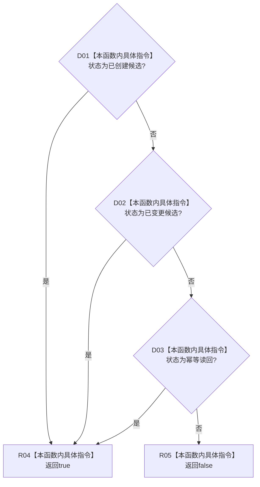

# CF-L5-0283 正式关系写入结果成功谓词现状流程图

图类型：现状流程图
代码版本：`4b80f1617dd70ec7a19e1a34efa9da768dce8927`
源码 blob：`89248cb1a21b2d49b000f92400990bb2c36ea6bc`
覆盖文件：`海中鱼巣/核心/仓库.正式关系.ixx:169-173`
唯一根函数：R1196
完整签名：`bool 海中鱼巣::正式关系写入结果::成功() const`
参数：无显式参数；只读访问当前正式关系写入结果
返回结果：状态为已创建候选、已变更候选或幂等读回时返回 true，其它状态返回 false
调用图：当前源码由 R1265 在 `海中鱼巣/核心/会话.节点直接身份结构写入.ixx:325` 直接调用；共享边 RCE3922 的 R0897 泛化端点不对应直接源码调用；本函数无直接项目函数调用和外部边界
逐行映射表：`流程图/代码流程图/L5/CF-L5-0283_成功_逐行代码映射表.md`
输入契约 / 调用语境表：写入会话登记关系候选前判断仓库写入结果是否属于成功状态
非成功返回二分审查表：false 是状态分类谓词结果；具体逻辑内返回或内部错误由状态值和调用语境裁决
偏差清单：项目入边需由共享关系维护者按当前源码校正
依据提交 / 结构化消息：`466d1ab0`；正式身份 R1196、待校正边 RCE3922
验证输出：本批仅源码、关系表、Mermaid 和逐行覆盖机械验证
不得作为施工许可：是
不得宣称：true 单独证明候选存在、事务已确认或关系已发布

## 流程图

## 当前边界

- 谓词不检查 `当前关系` 或 `候选` optional 是否与状态相符。
