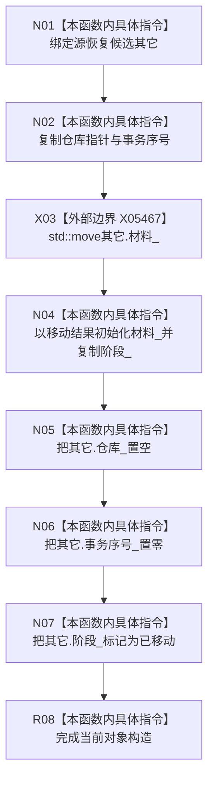

# CF-L5-0284 正式关系恢复候选移动构造现状流程图

图类型：现状流程图
代码版本：`4b80f1617dd70ec7a19e1a34efa9da768dce8927`
源码 blob：`89248cb1a21b2d49b000f92400990bb2c36ea6bc`
覆盖文件：`海中鱼巣/核心/仓库.正式关系.ixx:216-222`
唯一根函数：R1197
完整签名：`海中鱼巣::正式关系恢复候选::正式关系恢复候选(正式关系恢复候选&& 其它)`
参数：`其它` 为待转移的右值引用；构造期间可修改，生命周期由调用方持有
返回结果：构造函数，无独立返回值；当前对象取得仓库指针、事务序号、权威材料和阶段，源对象被清空并标记已移动
调用图：当前源码由 R1217 在 `海中鱼巣/核心/仓库.正式关系.ixx:481` 经 optional emplacement 触发；共享边 RCE3923 的 R0897 泛化端点不对应直接源码调用；外部边界 X05467 `std::move`
逐行映射表：`流程图/代码流程图/L5/CF-L5-0284_正式关系恢复候选_逐行代码映射表.md`
输入契约 / 调用语境表：正式关系仓库建立恢复未发布候选时把临时候选移入结果 optional
非成功返回二分审查表：`noexcept`，无显式失败返回
偏差清单：项目入边需由共享关系维护者按当前源码校正
依据提交 / 结构化消息：`466d1ab0`；正式身份 R1197、待校正边 RCE3923、边界 X05467
验证输出：本批仅源码、关系表、Mermaid 和逐行覆盖机械验证
不得作为施工许可：是
不得宣称：移动构造代表恢复候选已确认、发布或仓库已恢复

## 流程图

## 当前边界

- 权威材料所有权移入当前对象；源对象只保留已移动壳，不代表恢复事务已提交。
