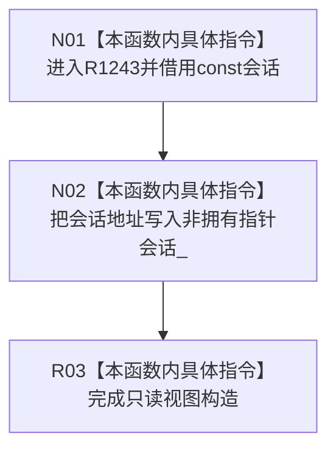

# CF-L5-0302 `节点直接身份结构提交准备只读视图` 构造现状流程图

图类型：现状流程图
代码版本：`4b80f1617dd70ec7a19e1a34efa9da768dce8927`
源码 blob：`ca407389bb111031643ec2d9fa41157166775db6`
覆盖文件：`海中鱼巣/核心/会话.节点直接身份结构写入.ixx:78-79`
唯一根函数：R1243
完整签名：`海中鱼巣::节点直接身份结构提交准备只读视图::节点直接身份结构提交准备只读视图(const 节点直接身份结构写入会话& 会话)`
参数：非拥有借用 const `会话`；调用方必须保证视图使用期间会话仍存活
返回结果：构造只读视图，把 `会话_` 保存为指向实参会话的 const 指针
已登记调用方：R1047（RCE3644）、R0897（RCE4007）
直接项目函数：无
外部边界：无
逐行映射表：`流程图/代码流程图/L5/CF-L5-0302_节点直接身份结构提交准备只读视图_逐行代码映射表.md`
非成功口径：构造器声明 `noexcept`，当前函数内没有拒绝分支；悬空风险由调用方生命周期前置约束承担
不得作为施工许可：是
不得宣称：视图拥有会话、延长会话生命周期或冻结会话内容

## 流程图

## 当前边界

- 构造过程只保存地址，不复制会话，不读取或修改会话内机器事实。
- 类已删除默认、复制和移动构造/赋值；这些声明不属于本根函数范围。
