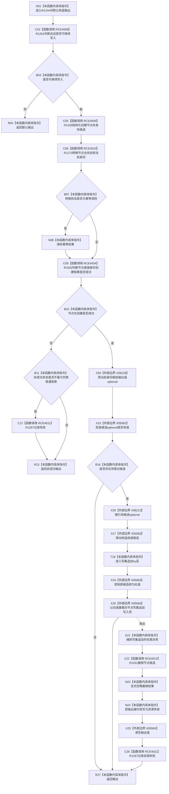

# CF-L5-0303 `节点直接身份结构写入会话::创建节点候选` 现状流程图

图类型：现状流程图
代码版本：`4b80f1617dd70ec7a19e1a34efa9da768dce8927`
源码 blob：`ca407389bb111031643ec2d9fa41157166775db6`
覆盖文件：`海中鱼巣/核心/会话.节点直接身份结构写入.ixx:98-129`
唯一根函数：R1244
完整签名：`节点直接身份带值结构写入结果<节点句柄> 海中鱼巣::节点直接身份结构写入会话::创建节点候选(节点类型 类型, 节点稳定主键 稳定主键)`
参数：`类型`、`稳定主键` 按值输入；借用当前写入会话
返回结果：入口允许时请求节点仓形成未发布候选并转换操作结果；成功可返回当前身份，候选入本会话写集后等待后续确认或撤销
已登记调用方：R0897（RCE4013）
直接项目函数：R1261（RCE4008）、R1429（RCE4009）、R1273（RCE4010）、R1502（RCE4004）、R1267（RCE4011）、R1431（RCE4012）
外部边界：X05562 `optional::has_value`、X05563 `std::move`、X05564 `vector<节点写入项>::push_back(节点写入项&&)`、X05565 `optional::reset`、X06212 `optional<节点直接身份未发布候选>::operator*`、X06218 `optional<节点句柄>::operator=(const 节点句柄&)`
逐行映射表：`流程图/代码流程图/L5/CF-L5-0303_创建节点候选_逐行代码映射表.md`
非成功口径：入口不可继续时返回默认入口拒绝；节点仓非成功时返回转换结果，非身份冲突、入口拒绝、事务拒绝、版本漂移的状态还会记录失败；写集追加异常时撤销候选并改写为资源失败
异常：节点仓创建和结果转换异常直接传播；仅写集 `push_back` 异常由当前函数捕获。撤销或记录失败若抛出仍向外传播
不得作为施工许可：是
不得宣称：返回成功等于候选已最终发布，或被排除的四类非成功状态已经写入失败账

## 流程图

## 当前边界

- RCE4004 在本批共享表收口时原地纠正为 R1244→R1502；不另建重复边。
- 候选只在 X20 成功后进入本会话写集；异常路径尝试撤销仓库候选，随后清空已返回值并记录资源失败。
- `创建.候选` 无值但创建成功时，函数仍返回当前身份，不追加写集，典型语境是幂等读回。
