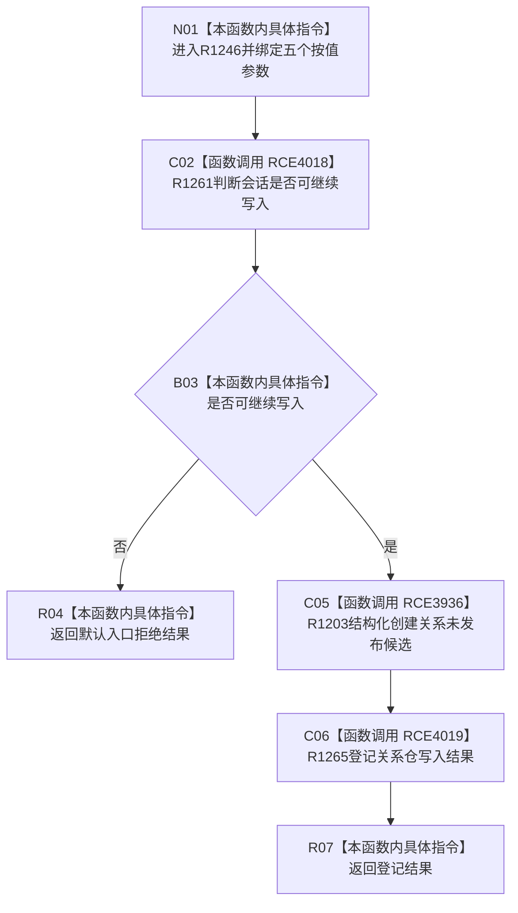

# CF-L5-0304 `节点直接身份结构写入会话::创建关系候选` 现状流程图

图类型：现状流程图
代码版本：`4b80f1617dd70ec7a19e1a34efa9da768dce8927`
源码 blob：`ca407389bb111031643ec2d9fa41157166775db6`
覆盖文件：`海中鱼巣/核心/会话.节点直接身份结构写入.ixx:148-157`
唯一根函数：R1246
完整签名：`节点直接身份带值结构写入结果<关系句柄> 海中鱼巣::节点直接身份结构写入会话::创建关系候选(关系类型 类型, 节点句柄 源节点, 节点句柄 目标节点, std::int64_t 顺序号, 关系稳定主键 计划稳定主键)`
参数：关系类型、源节点、目标节点、顺序号和计划稳定主键均按值输入
返回结果：入口允许时把关系仓结构化创建结果交给 R1265 登记并返回；入口拒绝时返回默认结果
已登记调用方：R1136（RCE3737）、R1137（RCE3750）、R0897（RCE4020）
直接项目函数：R1261（RCE4018）、R1203（RCE3936）、R1265（RCE4019）
外部边界：无
逐行映射表：`流程图/代码流程图/L5/CF-L5-0304_创建关系候选_逐行代码映射表.md`
非成功口径：入口不可继续写入时返回默认入口拒绝；仓库和登记阶段的其它非成功由 R1203、R1265 的结果承载
不得作为施工许可：是
不得宣称：返回成功等于关系已最终发布，或本函数自身完成关系候选确认

## 流程图

## 当前边界

- R1203 接收当前会话事务序号；本函数不直接持有关系候选，写集登记和补偿由 R1265 承担。
- 返回表达式不捕获异常，R1203 或 R1265 的异常直接传播。
