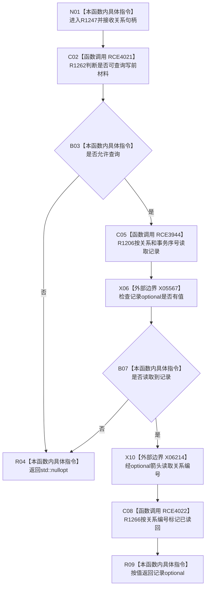

# CF-L5-0305 `节点直接身份结构写入会话::读取关系` 现状流程图

图类型：现状流程图
代码版本：`4b80f1617dd70ec7a19e1a34efa9da768dce8927`
源码 blob：`ca407389bb111031643ec2d9fa41157166775db6`
覆盖文件：`海中鱼巣/核心/会话.节点直接身份结构写入.ixx:173-179`
唯一根函数：R1247
完整签名：`std::optional<正式关系记录> 海中鱼巣::节点直接身份结构写入会话::读取关系(关系句柄 关系)`
参数：关系句柄按值输入；借用当前写入会话
返回结果：允许查询且关系仓返回记录时，按关系编号标记对应候选已读回并返回记录；否则返回空 optional
已登记调用方：R1136（RCE3740）、R1137（RCE3752）、R0897（RCE4023）
直接项目函数：R1262（RCE4021）、R1206（RCE3944）、R1266（RCE4022）
外部边界：X05567 `std::optional<T>::has_value()`、X06214 `std::optional<正式关系记录>::operator->()`
逐行映射表：`流程图/代码流程图/L5/CF-L5-0305_读取关系_逐行代码映射表.md`
非成功口径：入口不可查询或关系仓不命中都返回空 optional；空值不区分原因
不得作为施工许可：是
不得宣称：返回记录已最终发布、空 optional 证明关系从未存在，或读回标记修改关系仓记录

## 流程图

## 当前边界

- 只有实际读到记录才调用 R1266；标记作用于会话关系写集，不改变 R1206 返回的仓库记录。
- 本函数不捕获下游异常；准入、读取或标记异常直接传播。
