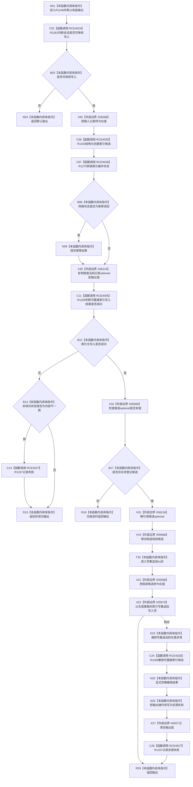

# CF-L5-0306 `节点直接身份结构写入会话::创建索引候选` 现状流程图

图类型：现状流程图
代码版本：`4b80f1617dd70ec7a19e1a34efa9da768dce8927`
源码 blob：`ca407389bb111031643ec2d9fa41157166775db6`
覆盖文件：`海中鱼巣/核心/会话.节点直接身份结构写入.ixx:189-213`
唯一根函数：R1248
完整签名：`节点直接身份带值结构写入结果<可重建索引记录> 海中鱼巣::节点直接身份结构写入会话::创建索引候选(可重建索引记录 记录)`
参数：索引记录按值输入，并在仓库调用处移动
返回结果：入口允许时请求索引仓形成候选、转换操作结果并保存当前记录；成功且存在候选时追加到索引写集，追加异常则撤销候选、清值并记录资源失败
已登记调用方：R1136（RCE3738）、R1137（RCE3751）、R0897（RCE4029）
直接项目函数：R1261（RCE4024）、R1163（RCE4025）、R1275（RCE4026）、R1159（原地纠正后的 RCE4005）、R1267（RCE4027）、R1169（RCE4028）；RCE4240、RCE4268、RCE4315 在 206 行分别错连 R1385、R1353、R1331，均不是该静态接收者调用
外部边界：X05568 `std::move`、X05569 `optional::has_value`、X05570 `vector<索引写入项>::push_back(索引写入项&&)`、X05571 `optional::reset`、X06215 `optional<可重建索引记录>` copy assignment、X06216 `optional<可重建索引候选>::operator*`
逐行映射表：`流程图/代码流程图/L5/CF-L5-0306_创建索引候选_逐行代码映射表.md`
非成功口径：入口不可继续时返回默认入口拒绝；索引仓非成功时返回转换结果，仅内部不一致记录失败；写集追加异常改写为资源失败
异常：仓库创建、结果转换和成功判定异常直接传播；仅写集 `push_back` 异常由本函数捕获。撤销或记录失败异常继续传播
不得作为施工许可：是
不得宣称：返回成功等于索引候选已最终发布、撤销调用一定成功，或三条错误仓库撤销边是当前代码事实

## 流程图

## 当前边界

- RCE4005 在本批共享表收口时原地纠正为 R1248→R1159；不另建重复边。
- 206 行 `索引_` 的静态类型是 `可重建索引仓库`，唯一真实撤销调用是 R1169。RCE4240、RCE4268、RCE4315 指向其它三种仓库的撤销函数，图中不把它们画成当前调用。
- 候选只在 X22 成功后进入本会话写集；异常路径对仓库候选执行补偿性撤销，并把调用方可见结果改写为资源失败。
