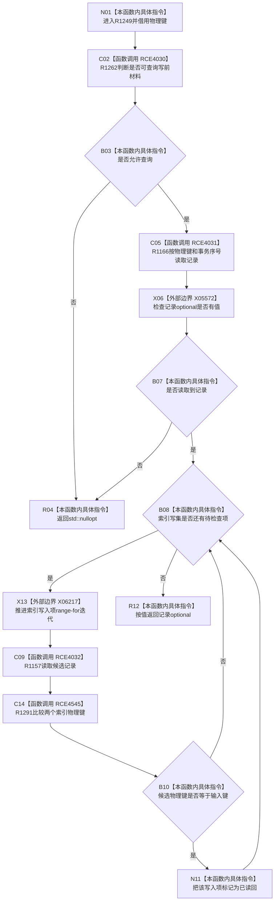

# CF-L5-0307 `节点直接身份结构写入会话::读取索引物理键` 现状流程图

图类型：现状流程图
代码版本：`4b80f1617dd70ec7a19e1a34efa9da768dce8927`
源码 blob：`ca407389bb111031643ec2d9fa41157166775db6`
覆盖文件：`海中鱼巣/核心/会话.节点直接身份结构写入.ixx:215-223`
唯一根函数：R1249
完整签名：`std::optional<可重建索引记录> 海中鱼巣::节点直接身份结构写入会话::读取索引物理键(const 索引物理键& 键)`
参数：非拥有借用索引物理键；借用当前写入会话
返回结果：允许查询且索引仓在当前事务中返回记录时，标记写集中同物理键候选为已读回并返回记录；否则返回空 optional
已登记调用方：R1136（RCE3741）、R1137（RCE3753）、R0897（RCE4033）
直接项目函数：R1262（RCE4030）、R1166（RCE4031）、R1157（RCE4032）、R1291（RCE4545）
外部边界：X05572 `std::optional<T>::has_value()`、X06217 `std::vector<索引写入项>` range-for 聚合边界
逐行映射表：`流程图/代码流程图/L5/CF-L5-0307_读取索引物理键_逐行代码映射表.md`
非成功口径：入口不可查询或索引仓不命中都返回空 optional；空值不区分原因
不得作为施工许可：是
不得宣称：返回记录已最终发布、空 optional 证明物理键从未存在，或已读回标记修改索引仓记录

## 流程图

## 当前边界

- 遍历会标记所有物理键相等的索引写集项，不在首次命中后提前退出。
- R1157 返回候选内部记录的 const 引用，该引用只用于本行比较，不越过候选或循环项生命周期。
