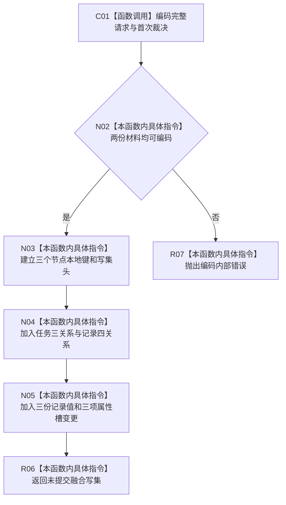

# CF-L5-0309 形成初次筹办融合写集现状流程图

图类型：现状流程图
代码版本：`7d3e7c9e32623aaa9aa4b4c90b53ef634eb6f094`；源码 blob：`d93c97b38a034e868d7d3c0796275d23bf48b652`
覆盖文件：`海中鱼巣/领域/服务.L2任务结构.ixx:4486-4543`
唯一根函数：R1520
完整签名：`L1所有者范围写集请求 海中鱼巣::L2任务结构内部::形成初次筹办融合写集(const L2新增任务与首次初次筹办准备记录请求& 请求, const 任务身份来源定位& 来源, const 任务结构类型定位& 类型, const 任务初次筹办准备记录定位& 记录定位)`
参数：只读融合请求及 task owner 的任务、结构类型和首次记录登记定位。
返回结果：尚未提交的一个 owner-scoped 中性写集；编码失败抛出内部异常。
调用图：`流程图/主程序可达调用关系/06_需求初次筹办工作包当前调用子图.md`；逐行映射表：同目录 `CF-L5-0309_形成初次筹办融合写集_逐行代码映射表.md`
输入契约 / 调用语境表：调用子图“输入契约与非成功二分”
非成功返回二分审查表：调用子图“输入契约与非成功二分”
偏差清单：调用子图“当前实现边界与偏差”
依据提交 / 结构化消息：`17edb9d9` / `7d3e7c9e`
验证输出：静态源码复核；提交与运行未执行
不得作为施工许可：是
不得宣称：局部写集已经发布或跨 owner 原子

