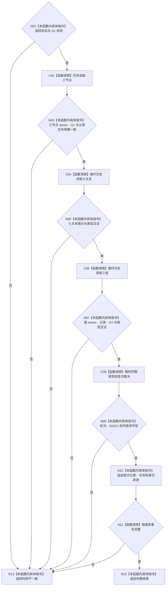

# CF-L5-0310 读回初次筹办融合首次结果现状流程图

图类型：现状流程图
代码版本：`7d3e7c9e32623aaa9aa4b4c90b53ef634eb6f094`；源码 blob：`d93c97b38a034e868d7d3c0796275d23bf48b652`
覆盖文件：`海中鱼巣/领域/服务.L2任务结构.ixx:4557-4686`
唯一根函数：R1521
完整签名：`L2新增任务与首次初次筹办准备记录结果 海中鱼巣::L2任务结构内部::读回初次筹办融合首次结果(const L1事实基座服务& 第一层服务, const 任务身份来源定位& 来源, const 任务结构类型定位& 类型, const 任务初次筹办准备记录定位& 记录定位, const 初次筹办融合写入编码映射& 映射, L2结构状态 返回状态, std::uint64_t G1)`
参数：L1 只读服务、task owner 定位、13 项融合编码、返回状态和首次发布代次 G1。
返回结果：完整首次记录、任务与身份来源；任一历史形状不一致时返回内部不一致。
调用图：`流程图/主程序可达调用关系/06_需求初次筹办工作包当前调用子图.md`；逐行映射表：同目录 `CF-L5-0310_读回初次筹办融合首次结果_逐行代码映射表.md`
输入契约 / 调用语境表：调用子图“输入契约与非成功二分”
非成功返回二分审查表：调用子图“输入契约与非成功二分”
偏差清单：调用子图“当前实现边界与偏差”
依据提交 / 结构化消息：`17edb9d9` / `7d3e7c9e`
验证输出：静态源码复核；运行验证未执行
不得作为施工许可：是
不得宣称：当前任务仍存续或历史记录会恢复任务

