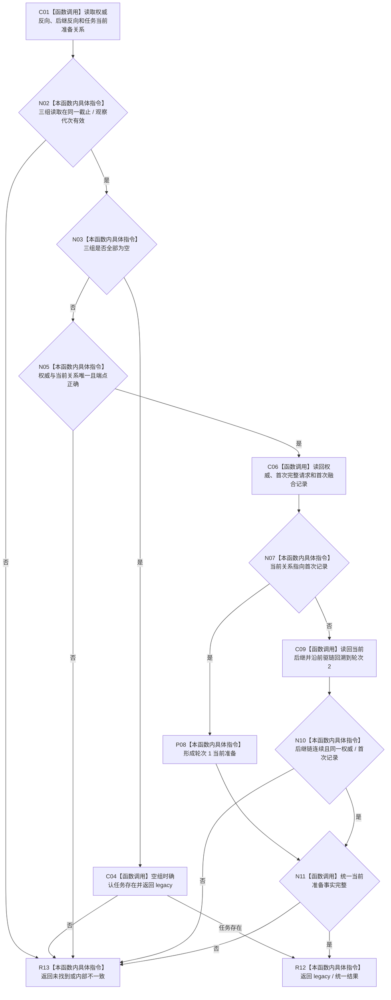

# CF-L5-0312 读取筹办轮次分区投影现状流程图

图类型：现状流程图
代码版本：`dd8a7810693b7892b3265333f762b7c1c3bcd4d8`；源码 blob：`6e28721b63e27f96abc2abb6e9335c40484b9afc`
覆盖文件：`海中鱼巣/领域/服务.L2任务结构.ixx:5189-5342`
唯一根函数：R1530
完整签名：`L2按任务读取筹办轮次分区结果 海中鱼巣::L2任务结构内部::读取筹办轮次分区投影(const L1事实基座服务& 第一层服务, const L1所有者范围写端口& 写入端口, const 任务身份来源定位& 来源, const 任务结构类型定位& 类型, const 任务初次筹办准备记录定位& 初次定位, const 任务筹办轮次定位& 轮次定位, const L2按任务读取筹办轮次分区请求& 请求, std::uint64_t 截止, std::uint64_t 观察代次)`
参数：L1 读写边界、task owner 定位、任务请求、历史截止和观察代次。
返回结果：统一当前准备、legacy 分区，或未找到 / 内部不一致。
调用图：`流程图/主程序可达调用关系/07_任务统一筹办轮次权威当前调用子图.md`；逐行映射表：同目录配对文件。
验证输出：静态源码复核；运行验证未执行
不得作为施工许可：是

