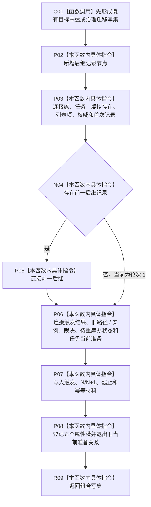

# CF-L5-0313 形成统一目标未达成迁移写集现状流程图

图类型：现状流程图
代码版本：`dd8a7810693b7892b3265333f762b7c1c3bcd4d8`；源码 blob：`6e28721b63e27f96abc2abb6e9335c40484b9afc`
覆盖文件：`海中鱼巣/领域/服务.L2任务结构.ixx:2763-2841`
唯一根函数：R1531
完整签名：`L1所有者范围写集请求 海中鱼巣::L2任务结构内部::形成统一目标未达成迁移写集(const L2提交目标未达成待重筹办迁移请求& 请求, const L2任务治理状态事实& 前态, const L2任务目标裁决证据事实& 证据, 稳定编码 当前治理关系编码, 稳定编码 当前路径关系编码, 稳定编码 当前实例关系编码, 稳定编码 当前筹办准备关系编码, const L2任务当前筹办准备事实& 当前准备, const 任务身份来源定位& 来源, const 任务结构类型定位& 类型, const 任务筹办轮次定位& 轮次定位)`
参数：已互证统一推进请求、治理前态、当前关系编码和定位。
返回结果：尚未提交的统一目标未达成迁移 owner-scoped 写集。
调用图：`流程图/主程序可达调用关系/07_任务统一筹办轮次权威当前调用子图.md`；逐行映射表：同目录配对文件。
验证输出：静态源码复核；运行验证未执行
不得作为施工许可：是

