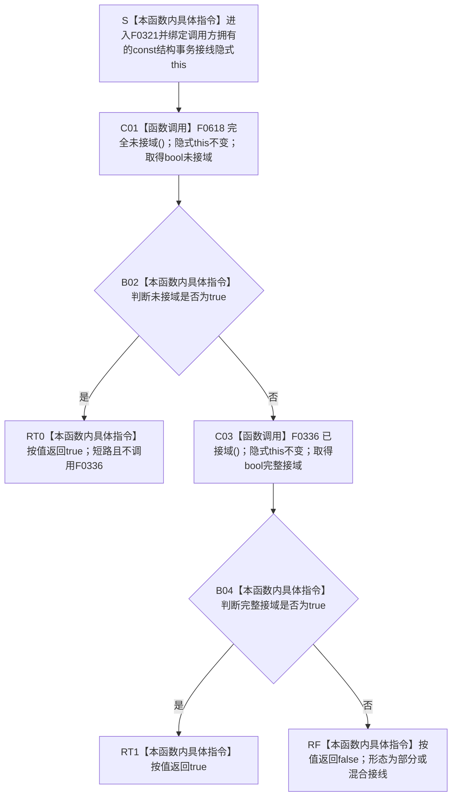

# CF-L6-0001 `结构事务接线::接线形态有效` 现状流程图

图类型：现状流程图
代码版本：`a48a70b2d678dea64dd8228adb4f26f0badd9506`
覆盖文件：`海中鱼巣/核心/结构事务接线.数据.h:82-84`
唯一根函数：F0321
完整签名：`bool 海中鱼巣::结构事务接线::接线形态有效() const`
参数：无显式参数；隐式 `this` 为调用方拥有、调用期有效且保持不变的 `const 结构事务接线*` 借用
返回结果：按值返回 `bool`；完全未接域或八项完整接域时为 `true`，部分 / 混合接线时为 `false`
非法值 / 拒绝：没有合法空、悬空或并发写入中的 `this`；此类输入违反 C++ 生命周期 / 并发前置而非结构化 `false`
已登记调用方：F0135 的 E0613；F0136 的 E0614 / E0615；F0137 的 E0617 / E0618；F0138 的 E0620 / E0621
直接项目函数：F0618 `完全未接域()`、F0336 `已接域()`
调用图：`流程图/代码流程图/00_调用知识图谱.md`
逐行映射表：`流程图/代码流程图/L6/CF-L6-0001_结构事务接线接线形态有效_逐行代码映射表.md`
输入契约 / 调用语境表：本文“调用语境与非成功分账”
非成功返回二分审查表：本文“调用语境与非成功分账”
偏差清单：`流程图/代码流程图/00_规范偏差审计.md` 的 F0321 切片
依据提交 / 结构化消息：冻结源码提交 `a48a70b2d678dea64dd8228adb4f26f0badd9506`；主智能体逐行复核；头文件不由候选工具单独裁决控制流
入口前置：调用方已完成接线对象构造；当前根可达四个仓库构造函数在第一笔仓库访问前调用本函数
结构读取与写入：本函数不直接读取八项字段，而是顺序调用 F0618 / F0336；不写节点、关系、索引、领域记录或接线
逻辑内返回：`false` 表示接线既非全空也非八项完整，供调用方在第一笔结构访问前拒绝
内部错误：完整形态中的回调目标错误、域 / 纪元陈旧、共享状态动态类型错误或调用期间数据竞争不会由本函数检出
生命周期与资源释放：不延长 `this`、共享状态或回调生命周期；返回值不携带许可、令牌、引用或所有权
异常：本函数未声明 `noexcept`；当前两个被调谓词只做值式 / 指针布尔读取，正常路径不分配
并发 / 幂等：对象保持不可变时重复调用确定且零写；对同一对象并发写入字段属于数据竞争，两个被调谓词也不构成原子快照
验证入口：源码 blob `9d89cee25f00ba0f721d0b6c1bea517524e40663`、82—84 行、七条可达入边与 E1638 / E1639 双向闭合
验证输出：本批只执行 AST / 源码 / 聚合文档机械核对和文档治理验证，不运行构建或程序
依据：`规范/0050_项目通用机器逻辑与禁止性规则总纲_20260721.md`、`规范/0600_代码函数流程图应用与维护规范.md`、`规范/4040_子规范_不透明结构事务候选确认撤销与最后发布.md`、`规范/4050_子规范_入口拒绝逻辑内结果与内部逻辑错误.md`、`规范/详细设计/不透明结构写入会话许可内探测计量与全参与者原子收口详细设计.md`
不得作为施工许可：是
不得宣称：接线已经可用、回调语义正确、令牌有效、事务域当前、生产主装配已接域或结构事务能力已经验收

## 流程图

## 项目源码调用合同

| 节点 | 被调函数 | 参数 / 所有权 | 返回绑定 | 调用条件 | 被调图 |
| --- | --- | --- | --- | --- | --- |
| C01 | F0618 `bool 海中鱼巣::结构事务接线::完全未接域() const` | 同一隐式 `const this` 借用；无显式参数 | `bool` 绑定为 `||` 左操作数 | 总是 | 待生成 |
| C03 | F0336 `bool 海中鱼巣::结构事务接线::已接域() const` | 同一隐式 `const this` 借用；无显式参数 | `bool` 直接决定最终返回 | C01 返回 `false` | 待生成 |

## 调用语境与非成功分账

| 调用语境 | 上游保证 | `true` 的精确含义 | `false` 的处理 | 二分口径 |
| --- | --- | --- | --- | --- |
| F0135 主信息仓库构造 | 接线值已经完成成员构造 | 全空兼容或八项完整接域之一 | 构造器在仓库访问前抛 `invalid_argument` | 写前入口拒绝 |
| F0136 节点仓库构造 | 本仓库与主信息仓库接线分别已经完成构造 | 每一接线独立通过形态分类 | 任一为 `false` 时构造器拒绝；两者为真后另调 F0322 比较窄同域身份 | 写前入口拒绝 |
| F0137 关系仓库构造 | 本仓库与节点仓库接线分别已经完成构造 | 同上 | 任一为 `false` 时构造器拒绝；后续一致性由 F0323 承担 | 写前入口拒绝 |
| F0138 索引仓库构造 | 本仓库与节点仓库接线分别已经完成构造 | 同上 | 任一为 `false` 时构造器拒绝；后续一致性由 F0324 承担 | 写前入口拒绝 |
| 当前不可达源码调用 | 结构事务自检和特征值服务源码另有调用点，但其调用函数不在当前根闭包 | 不建立当前调用边 | 只作来源 / 差距证据 | 不进入当前图谱 |

## 当前偏差与边界

- F0321 只分类“全空”或“八项字段均呈有效形状”，不比较两个接线是否同域，也不执行许可取得、令牌验证或撤销失败隔离回调。
- F0618 / F0336 对 `std::shared_ptr<void>` 使用布尔转换；拥有控制块但 alias 存储指针为空的对象会被视为空。现行详细设计写“全部字段为空”，而当前实现没有检查控制块是否存在，形成窄语义差异候选。
- 域编号和运行期纪元只检查零 / 非零；共享状态只检查存储指针；五个函数指针只检查空 / 非空。`true` 不能扩大为新鲜度、同源性或回调正确性证明。
- 七个当前可达调用点已经登记；特征值服务的十一处源码调用和未接入自检的三处调用不伪造为当前根可达边。
