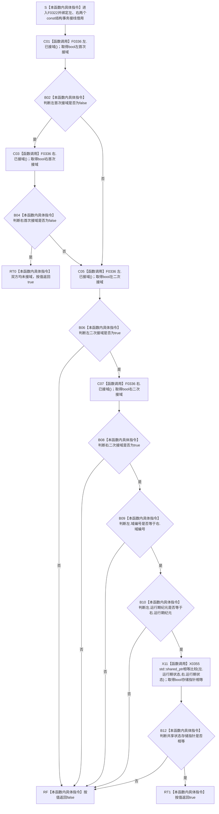

# CF-L6-0002 `节点仓库.cpp::{匿名命名空间}::接线一致` 现状流程图

图类型：现状流程图
代码版本：`a48a70b2d678dea64dd8228adb4f26f0badd9506`
覆盖文件：`海中鱼巣/核心/节点仓库.cpp:16-21`
唯一根函数：F0322
完整签名：`bool 海中鱼巣::{匿名命名空间@节点仓库.cpp}::接线一致(const 海中鱼巣::结构事务接线& 左, const 海中鱼巣::结构事务接线& 右)`
参数：`左`、`右` 均为调用方拥有、调用期有效且保持不变的 `const 结构事务接线&` 借用；允许两引用指向同一对象
返回结果：按值返回 `bool`；双方均未接域时为 `true`；双方均接域且域编号、运行期纪元和共享状态存储指针相等时为 `true`；其它情况为 `false`
非法值 / 拒绝：函数自身不拒绝部分接线、悬空引用或并发写入；当前唯一调用方 F0136 先用 F0321 分别验证形态
已登记调用方：F0136 → F0322 的 E0616，位置 `海中鱼巣/核心/节点仓库.cpp:48`
直接项目函数：F0336 `结构事务接线::已接域()`，四个独立短路调用点
调用图：`流程图/代码流程图/00_调用知识图谱.md`
逐行映射表：`流程图/代码流程图/L6/CF-L6-0002_节点仓库接线一致_逐行代码映射表.md`
输入契约 / 调用语境表：本文“调用语境与非成功分账”
非成功返回二分审查表：本文“调用语境与非成功分账”
偏差清单：`流程图/代码流程图/00_规范偏差审计.md` 的 F0322 切片
依据提交 / 结构化消息：冻结源码提交 `a48a70b2d678dea64dd8228adb4f26f0badd9506`；Clang 普通 CPP 候选成功抽取 4 个 `已接域()` 调用和 1 个 `shared_ptr` 相等调用；主智能体逐行复核
入口前置：当前唯一调用方已经分别取得两次 F0321 `true`，因此每项只可能是全空兼容或八项完整接域形态
结构读取与写入：读取两接线的形态、域编号、运行期纪元和 `shared_ptr<void>` 存储指针；不写接线或项目机器事实
逻辑内返回：双方合法形态不属于同一窄事务域时返回 `false`，供节点仓库构造器在发布对象前拒绝
内部错误：生产装配本应传入同一接线却返回 `false`、调用方绕过 F0321 前置、引用悬空或并发写入均需追根因
生命周期与资源释放：不延长左右接线或共享状态生命周期；不复制 `shared_ptr`，不改变引用计数
异常：函数未声明 `noexcept`；当前比较路径不分配，标准 `shared_ptr` 相等运算为 `noexcept`
并发 / 幂等：不可变输入下重复调用确定且零写；四次 F0336 与三项字段读取不构成原子快照
验证入口：源码 blob `f38b979a3f7cefd182a50e0b687c5a6fffebc91c`、16—21 行、E0616、E1640—E1643 和 X0355 双向闭合
验证输出：AST 候选 `32 functions / 278 calls / 8 unresolved / 0 diagnostics` 只作当前函数抽取证据；本批不运行构建或程序
依据：`规范/0050_项目通用机器逻辑与禁止性规则总纲_20260721.md`、`规范/0600_代码函数流程图应用与维护规范.md`、`规范/4010_子规范_统一仓库稳定句柄与通用关系索引边界.md`、`规范/4040_子规范_不透明结构事务候选确认撤销与最后发布.md`、`规范/4050_子规范_入口拒绝逻辑内结果与内部逻辑错误.md`、`规范/详细设计/不透明结构写入会话许可内探测计量与全参与者原子收口详细设计.md`
不得作为施工许可：是
不得宣称：五个回调同源、共享状态控制块相同、事务域当前、许可可取得、令牌有效、主装配已接域或结构事务已经验收

## 流程图

## 项目源码调用合同

| 节点 | 被调函数 | 参数 / 所有权 | 返回绑定 | 调用条件 | 被调图 |
| --- | --- | --- | --- | --- | --- |
| C01 | F0336 `bool 结构事务接线::已接域() const` | 隐式 `this=&左`；无显式参数 | `bool 左首次接域` | 总是 | [F0336](CF-L6-0016_结构事务接线已接域_现状流程图.md) |
| C03 | F0336 `bool 结构事务接线::已接域() const` | 隐式 `this=&右`；无显式参数 | `bool 右首次接域` | C01 返回 `false` | [F0336](CF-L6-0016_结构事务接线已接域_现状流程图.md) |
| C05 | F0336 `bool 结构事务接线::已接域() const` | 隐式 `this=&左`；无显式参数 | `bool 左二次接域` | 非“双方均未接域”路径 | [F0336](CF-L6-0016_结构事务接线已接域_现状流程图.md) |
| C07 | F0336 `bool 结构事务接线::已接域() const` | 隐式 `this=&右`；无显式参数 | `bool 右二次接域` | C05 返回 `true` | [F0336](CF-L6-0016_结构事务接线已接域_现状流程图.md) |

## 调用语境与非成功分账

| 语境 | 上游保证 | 本函数结果 | 二分口径 | 后继 |
| --- | --- | --- | --- | --- |
| F0136 节点仓库构造 | 左右接线分别通过 F0321；对象尚未发布，也未访问仓库正文 | `true` 只证明双方均未接域，或三项窄身份相等 | 正常准入结果 | 构造器继续完成对象建立 |
| F0136 节点仓库构造 | 同上 | `false` 表示一接一未接，或双方接域但域 / 纪元 / 状态存储指针不同 | 写前入口拒绝 | 构造器抛 `invalid_argument` |
| 绕过 F0321 的假设调用 | 不成立 | 两个部分接线都让 F0336 为假时，本函数会把它们视为“双方未接域”并返回真 | 内部使用错误 | 不得把当前唯一调用前置静默删除 |
| 正式生产同接线却不一致 | 设计上应为同一接线 | 返回 `false` | 追根因解决 | 核对装配所有权、接线复制和生命周期 |

## 当前偏差与边界

- `std::shared_ptr<void>::operator==` 比较 `get()` 存储指针，不证明控制块相同；同一控制块的不同 alias 指针可比较不等，不同控制块持有同一裸指针可比较相等。
- 本函数不比较五个许可 / 验证 / 隔离回调函数指针；两个八项完整接线可以在三项窄身份相等但回调目标不同的情况下返回 `true`。
- 四次 F0336 和后续字段读取没有锁或快照；如果调用期间字段被并发修改，存在数据竞争，不能把最终 `bool` 当作一致代次见证。
- X0355 只登记标准库相等与三项值式比较边界，不为标准库生成内部流程图。
