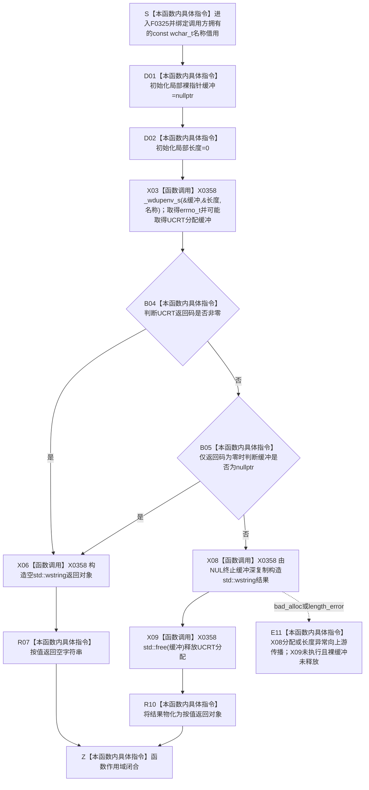

# CF-L6-0005 `SQL数据库适配.cpp::{匿名命名空间}::读取环境字段` 现状流程图

图类型：现状流程图
代码版本：`a48a70b2d678dea64dd8228adb4f26f0badd9506`
覆盖文件：`海中鱼巣/适配/SQL数据库适配.cpp:78-87`
唯一根函数：F0325
完整签名：`std::wstring 海中鱼巣::{匿名命名空间@SQL数据库适配.cpp}::读取环境字段(const wchar_t* 名称)`
参数：`名称` 是调用方拥有、调用期有效、不由本函数修改或释放的 NUL 终止宽字符串借用；当前两个可达调用点均传静态宽字符串字面量
返回结果：按值返回独立拥有的 `std::wstring`；成功时深复制环境字段；字段不存在、UCRT 返回非零、UCRT 返回空缓冲或字段内容为空时均表现为空字符串
非法值 / 拒绝：`nullptr`、悬空或未 NUL 终止的 `名称` 不满足外部 API 前置；本函数不先拒绝，`nullptr` 可进入 UCRT invalid-parameter 处理，不能稳定解释为空字符串
已登记调用方：F0158 → F0325 的 E0623 / E0624，位置 `海中鱼巣/适配/SQL数据库适配.cpp:316`、`:319`
直接项目函数：无
调用图：`流程图/代码流程图/00_调用知识图谱.md`
逐行映射表：`流程图/代码流程图/L6/CF-L6-0005_读取SQL环境字段_逐行代码映射表.md`
输入契约 / 调用语境表：本文“调用语境与非成功分账”
非成功返回二分审查表：本文“调用语境与非成功分账”
偏差清单：`流程图/代码流程图/00_规范偏差审计.md` 的 F0325 切片
依据提交 / 结构化消息：冻结源码提交 `a48a70b2d678dea64dd8228adb4f26f0badd9506`；Clang 普通 CPP 候选成功抽取外部调用和分支；工具观察提交与冻结提交的目标文件 blob 相同；主智能体逐行复核
入口前置：F0158 已构造默认 SQL 配置，分别传入 `L"HY_EGO_SQL_SERVER"` 与 `L"HY_EGO_SQL_DATABASE"`；两个环境读取不是同一原子快照
结构读取与写入：只读取进程环境材料并在 UCRT 缓冲与局部 `std::wstring` 间复制；不写运行期仓库、数据库或项目机器事实
逻辑内返回：缺失、UCRT 错误或空缓冲折叠为空字符串，F0158 保留对应默认字段；空字符串不携带错误原因
内部错误：非空环境值尚未经过 F0378 `配置字段可用` 准入；`std::wstring` 构造抛异常时裸缓冲未释放是资源生命周期缺口，不得包装为普通空值
生命周期与资源释放：成功取得非空 UCRT 缓冲后，本函数深复制为拥有字符串并调用 `std::free`；返回值不引用缓冲；异常路径见 E11
异常：未声明 `noexcept`；`std::wstring` 构造可抛 `std::bad_alloc` / `std::length_error` 并向上游传播，源码不会执行后继 `free`
并发 / 幂等：结果依赖调用时进程环境；环境不变时值式结果确定。两个字段分别读取，期间环境变化可形成混合快照
验证入口：源码 blob `de392dd23f45fc43186fe3d2b545969e2ea3625a`、78—87 行、E0623 / E0624 和 X0358 双向闭合
验证输出：AST 候选目标文件 `28 functions / 325 calls / 0 unresolved / 0 diagnostics`；本函数项目调用 `0`、外部边界操作候选 `5`；本批不运行构建、数据库或程序
依据：`规范/0050_项目通用机器逻辑与禁止性规则总纲_20260721.md`、`规范/0600_代码函数流程图应用与维护规范.md`、`规范/4050_子规范_入口拒绝逻辑内结果与内部逻辑错误.md`、`规范/详细设计/SQL Server结构审计投影与控制面板查看详细设计.md`
不得作为施工许可：是
不得宣称：环境配置已经合法、两个字段形成原子快照、SQL 已连接、数据库材料成为机器事实或资源异常缺口已经修复

## 流程图

## 项目源码调用合同

本函数没有项目源码被调函数。X0358 统一登记 Microsoft UCRT、标准库字符串和 C 运行库边界；这些外部函数及其包含文件不生成项目单函数流程图。

## 调用语境与非成功分账

| 语境 | 上游保证 | 当前结果 | 二分口径 | 后继 |
| --- | --- | --- | --- | --- |
| F0158 读取服务器字段 | `名称=L"HY_EGO_SQL_SERVER"`，默认配置已存在 | 非空字符串 | 外部配置材料 | 覆盖默认服务器；合法性留给后继 F0378 |
| F0158 读取数据库字段 | `名称=L"HY_EGO_SQL_DATABASE"`，默认配置已存在 | 非空字符串 | 外部配置材料 | 覆盖默认数据库；合法性留给后继 F0378 |
| 两个可达调用 | 名称是有效静态字面量 | 空字符串 | 协议允许的逻辑内返回 | F0158 保留对应默认字段 |
| X08 字符串构造 | UCRT 已返回成功和非空缓冲 | 抛出分配 / 长度异常 | 内部资源错误 | 异常上抛；裸缓冲未释放，需具名治理 |
| 假设非法名称 | 上游保证不成立 | UCRT invalid-parameter、错误码或未定义借用后果 | 非合法调用语境 | 不得画成稳定空值拒绝 |

## 当前偏差与边界

- 环境字段是外部配置材料，不是运行期机器事实；F0325 只读取和复制，不验证 SQL 字段安全性。
- 缺失、显式空字段、UCRT 错误和空缓冲全部折叠为空字符串，调用方无法区分原因；当前 F0158 合法地以默认值收口，但诊断粒度很窄。
- `长度` 接收 UCRT 输出但不参与后继判断或字符串构造；实际复制长度由 `std::wstring(const wchar_t*)` 再次扫描 NUL 终止符取得。
- X08 抛异常时 X09 尚未执行，UCRT 裸缓冲泄漏；这是当前异常资源生命周期缺口，本文只登记，不自动形成代码计划。
- `_wdupenv_s` 返回非零时源码按短路直接返回，不检查或释放可能的非空缓冲；是否可能非空依赖外部失败合同，当前函数自身没有资源读回证明。
- F0158 两次独立调用 F0325；环境在两次之间变化时可形成混合配置，不能宣称同点冻结。
