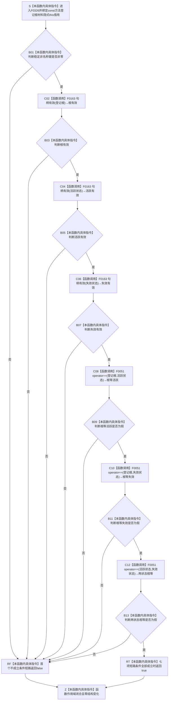

# CF-L6-0006 `方法登记根材料::完整` 现状流程图

图类型：现状流程图
代码版本：`a48a70b2d678dea64dd8228adb4f26f0badd9506`
覆盖文件：`海中鱼巣/领域/方法服务.h:137-145`
唯一根函数：F0326
完整签名：`bool 海中鱼巣::方法登记根材料::完整() const`
参数：无显式参数；隐式 `this` 是调用方拥有、调用期有效的 `const 方法登记根材料*` 只读借用
返回结果：按值返回 `bool`；`true` 只表示裸稳定键非零、三个节点句柄分别满足 F0163，且三个句柄经 F0051 两两不相等
非法值 / 拒绝：稳定键为零、任一句柄三分量存在零值或任意两句柄完整值相等时返回 `false`；不区分具体失败项
已登记调用方：F0160 → F0326 的 E0625，位置 `海中鱼巣/领域/方法服务.h:1337`
直接项目函数：F0163 `句柄有效(const 节点句柄&)` 三次；F0051 `operator==(const 节点句柄&, const 节点句柄&)` 三次
调用图：`流程图/代码流程图/00_调用知识图谱.md`
逐行映射表：`流程图/代码流程图/L6/CF-L6-0006_方法登记根材料完整_逐行代码映射表.md`
输入契约 / 调用语境表：本文“调用语境与非成功分账”
非成功返回二分审查表：本文“调用语境与非成功分账”
偏差清单：`流程图/代码流程图/00_规范偏差审计.md` 的 F0326 切片
依据提交 / 结构化消息：冻结源码提交 `a48a70b2d678dea64dd8228adb4f26f0badd9506`；当前 HEAD 的目标源码 blob 相同；Clang 头文件候选抽取与主智能体逐行复核
入口前置：当前唯一调用点先确认 `登记根材料_` optional 有值；材料各字段仍可能无效
结构读取与写入：只读当前值对象的一个 I64 和三个节点句柄；不访问仓库，不写节点、关系、索引、状态或方法事实
逻辑内返回：对普通值式候选，任一局部形状不成立返回 `false`
内部错误：F0160 在成功初始化材料上得到 `false` 时属于登记根材料结构不一致；本函数不返回具名原因
生命周期与资源释放：不取得或释放资源；不保存 `this`，返回后借用结束
异常：未声明 `noexcept`；当前函数及六个被调谓词只执行值读取与比较，不分配，但源码类型合同未把不抛出写入签名
并发 / 幂等：同一不可变值对象重复调用结果确定；`const` 不提供并发同步，调用期间并发改写同一对象属于数据竞争
验证入口：源码 blob `839dd462c70e8d54b6f22f1126d751ac9425398a`、137—145 行、E0625 与 E1652—E1657 双向闭合
验证输出：Clang 头文件候选 `方法服务.h: 102 functions / 1493 calls / 6 unresolved / 0 diagnostics`；F0326 自身项目调用 `6`、外部边界 `0`、未解析 `0`；本批不运行构建或程序
依据：`规范/0050_项目通用机器逻辑与禁止性规则总纲_20260721.md`、`规范/0600_代码函数流程图应用与维护规范.md`、`规范/3300_根规范_方法_20260720.md`、`规范/4010_子规范_统一仓库稳定句柄与通用关系索引边界.md`、`规范/5300_子规范_方法登记选择与执行规则_20260720.md`
不得作为施工许可：是
不得宣称：方法登记根存在、节点类型或角色正确、方法生命周期关系 23 完整、稳定主键成立、状态事实完整或登记根已经可用

## 流程图

## 项目源码调用合同

| 节点 | 被调函数 | 实参 | 结果绑定 | 条件 | 被调图 |
| --- | --- | --- | --- | --- | --- |
| C02 | F0163 `bool 句柄有效(const 节点句柄&)` | `登记根` const 借用 | `bool 根有效` | 稳定键非零 | [F0163](../L5/CF-L5-0044_节点句柄有效_现状流程图.md) |
| C04 | F0163 | `活跃状态` const 借用 | `bool 活跃有效` | 根有效 | [F0163](../L5/CF-L5-0044_节点句柄有效_现状流程图.md) |
| C06 | F0163 | `失效状态` const 借用 | `bool 失效有效` | 活跃有效 | [F0163](../L5/CF-L5-0044_节点句柄有效_现状流程图.md) |
| C08 | F0051 `bool operator==(const 节点句柄&, const 节点句柄&)` | `登记根, 活跃状态` | `bool 根等活跃` | 三句柄有效 | [F0051](../L4/CF-L4-0015_节点句柄_operator_equal_现状流程图.md) |
| C10 | F0051 | `登记根, 失效状态` | `bool 根等失效` | 根与活跃不等 | [F0051](../L4/CF-L4-0015_节点句柄_operator_equal_现状流程图.md) |
| C12 | F0051 | `活跃状态, 失效状态` | `bool 两状态相等` | 根与失效不等 | [F0051](../L4/CF-L4-0015_节点句柄_operator_equal_现状流程图.md) |

## 调用语境与非成功分账

| 语境 | 上游保证 | 当前结果 | 二分口径 | 后继 |
| --- | --- | --- | --- | --- |
| F0160 普通候选复核 | optional 有值，未保证字段形状 | `false` | 允许的值式候选拒绝 | F0160 返回登记根不完整 |
| F0160 成功初始化材料 | 初始化路径声称已形成登记根材料 | `false` | 内部结构错误 | 追查初始化写入、读回或材料组装 |
| 任一调用 | 七项局部形状成立 | `true` | 窄值式结果 | F0160 继续仓库、角色、状态和关系复核 |

## 当前偏差与边界

- `稳定非名称键 != 0` 只是旧单值键检查，不是 4010 的命名域与双 I64 稳定主键合同。
- 三个句柄有效只证明仓库编号、对象编号和版本均非零；不证明节点存在、未删除、类型正确或属于当前仓库代次。
- 两两不等只比较完整句柄值；不证明登记根与两个状态之间存在合法关系。
- 现行材料仍持有共享活跃 / 失效状态，属于旧 MR-D3 生命周期模型；5300 v0.4 已要求每个方法以关系 23 指向完整实例生命周期状态事实。
- 本函数名称中的“完整”只能解释为当前值对象局部形状完整，不能扩大为正式方法登记根或生命周期完整。
