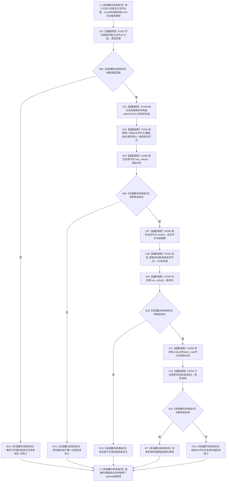

# CF-L6-0007 `方法服务::读取方法角色状态值` 现状流程图

图类型：现状流程图
代码版本：`a48a70b2d678dea64dd8228adb4f26f0badd9506`
覆盖文件：`海中鱼巣/领域/方法服务.h:1747-1761`
唯一根函数：F0327
完整签名：`海中鱼巣::方法角色状态 海中鱼巣::方法服务::读取方法角色状态值(海中鱼巣::节点句柄 方法节点, const 海中鱼巣::状态服务& 状态) const`
参数：`方法节点` 按值复制完整句柄；`状态` 是调用方拥有、调用期有效的 const 服务借用；隐式 `this` 是方法服务只读借用
返回结果：按值返回 `方法角色状态`；节点类型、唯一角色状态目标、I64 状态值和角色白名单全部成立时返回具名角色，否则统一返回 `未定义`
非法值 / 拒绝：无效、错误类型、缺失或多目标模板状态、状态值不可读、I64 不属于六个具名角色均折叠为 `未定义`
已登记调用方：F0160 → F0327 的 E0626，位置 `海中鱼巣/领域/方法服务.h:1338`
直接项目函数：F0333 `节点类型匹配`、F0330 `读取唯一目标`、F0329 `状态服务::读取状态值`、F0334 `方法角色状态有效`
调用图：`流程图/代码流程图/00_调用知识图谱.md`
逐行映射表：`流程图/代码流程图/L6/CF-L6-0007_读取方法角色状态值_逐行代码映射表.md`
输入契约 / 调用语境表：本文“调用语境与非成功分账”
非成功返回二分审查表：本文“调用语境与非成功分账”
偏差清单：`流程图/代码流程图/00_规范偏差审计.md` 的 F0327 切片
依据提交 / 结构化消息：冻结源码提交 `a48a70b2d678dea64dd8228adb4f26f0badd9506`；当前 HEAD 的目标源码 blob 相同；Clang 头文件候选抽取与主智能体逐行复核
入口前置：当前唯一调用点 F0160 已确认登记根材料局部形状和关系仓库编号非零，但仍以本函数复核登记根方法角色
结构读取与写入：经方法服务读取节点类型和唯一模板目标，经状态服务读取旧 I64 状态值；零写入
逻辑内返回：对普通只读查询，任一不成立项统一返回 `未定义`
内部错误：F0160 对已成功初始化登记根得到 `未定义` 时表示方法角色结构缺失或漂移
生命周期与资源释放：两个 optional 局部值在函数退出时析构；不保存方法句柄、状态服务或方法服务借用
异常：未声明 `noexcept`；被调仓库 / 服务读取或 optional 访问异常向上传播；两个 `value()` 均受同一局部 `has_value()` 前置保护
并发 / 幂等：仓库不变时结果确定；节点类型、关系目标与状态值分多次读取，不形成同一许可或同代次快照
验证入口：源码 blob `839dd462c70e8d54b6f22f1126d751ac9425398a`、1747—1761 行、E0626 与 E1658—E1661、X0359 双向闭合
验证输出：Clang 头文件候选 `方法服务.h: 102 functions / 1493 calls / 6 unresolved / 0 diagnostics`；F0327 自身项目调用 `4`、聚合外部操作 `6`、未解析 `0`；本批不运行构建或程序
依据：`规范/0050_项目通用机器逻辑与禁止性规则总纲_20260721.md`、`规范/0600_代码函数流程图应用与维护规范.md`、`规范/1160_根规范_状态节点_20260720.md`、`规范/3300_根规范_方法_20260720.md`、`规范/5300_子规范_方法登记选择与执行规则_20260720.md`
不得作为施工许可：是
不得宣称：方法角色事实已按现行类型化结构承载、目标状态是合法抽象状态、方法生命周期关系 23 完整或方法可执行

## 流程图

## 项目源码调用合同

| 节点 | 被调函数 | 实参 | 结果绑定 | 条件 | 被调图 |
| --- | --- | --- | --- | --- | --- |
| C01 | F0333 `bool 方法服务::节点类型匹配(节点句柄, 节点类型) const` | `方法节点, 节点类型::方法` | `bool 类型匹配` | 总是 | [F0333](CF-L6-0013_方法服务节点类型匹配_现状流程图.md) |
| C04 | F0330 `optional<节点句柄> 方法服务::读取唯一目标(...) const` | `方法节点, 模板, 状态, optional<I64>{0}` | `角色状态节点` | 类型匹配 | [F0330](CF-L6-0010_方法服务读取唯一目标四参数_现状流程图.md) |
| C08 | F0329 `optional<I64> 状态服务::读取状态值(节点句柄) const` | `状态` 隐式 this；目标节点句柄 | `状态值` | 唯一目标存在 | [F0329](CF-L6-0009_状态服务读取状态值_现状流程图.md) |
| C12 | F0334 `bool 方法服务::方法角色状态有效(方法角色状态) const` | `角色` | `bool 角色有效` | I64 状态值存在 | [F0334](CF-L6-0014_方法服务方法角色状态有效_现状流程图.md) |

## 调用语境与非成功分账

| 语境 | 上游保证 | 当前结果 | 二分口径 | 后继 |
| --- | --- | --- | --- | --- |
| 普通只读角色查询 | 不保证节点或角色结构成立 | `未定义` | 允许的逻辑内返回 | 调用方不把节点解释为具名方法角色 |
| F0160 初始化登记根复核 | 已声明登记根材料初始化成功 | `未定义` | 内部结构错误 | F0160 返回不完整并追查类型、关系或状态值 |
| F0160 初始化登记根复核 | 四项读取成立且角色为 `方法登记根` | 具名角色 | 窄读取结果 | F0160 继续两个共享状态和模板槽复核 |

## 当前偏差与边界

- F0327 通过通用 `模板` 关系和顺序号 0 读取角色状态，角色 I64 仍由 F0329 从旧主信息值槽取得，不是现行领域类型化记录。
- 函数不调用 F0328，也不验证角色状态目标是符合 1160 的长期抽象状态；实例状态只要 I64 可读且落入角色白名单，也可能被解释为方法角色。
- `读取唯一目标` 只保证当前通用关系筛选结果唯一；节点、关系和状态值分次读取，没有同一许可 / 版本快照。
- `未定义` 折叠错误方法节点、关系缺失、多目标、状态不可读和非法 I64，普通查询可接受，但在 F0160 的成功初始化语境中必须追根因。
- 5300 v0.4 已把方法生命周期迁移到关系 23 和每方法完整实例状态；本函数不能证明任何生命周期事实或方法可执行性。
